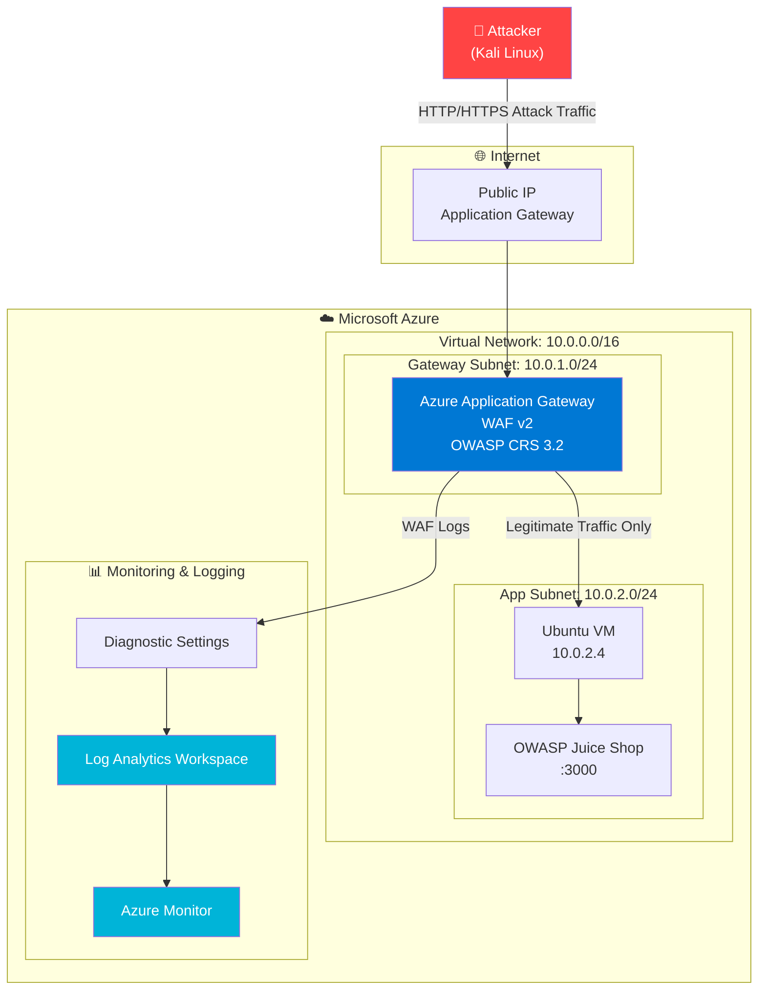

# Triển khai Web Application Firewall (WAF) trên Microsoft Azure
## Bảo vệ Website trước các Cuộc tấn công Tầng Ứng dụng

---

## Giới thiệu Đề tài

Đề tài này nghiên cứu và triển khai **Web Application Firewall (WAF)** sử dụng **Azure Application Gateway WAF v2** nhằm bảo vệ ứng dụng web trước các cuộc tấn công tầng ứng dụng (Application Layer - Layer 7) phổ biến theo chuẩn OWASP Top 10.

Môi trường thử nghiệm sử dụng **OWASP Juice Shop** — một ứng dụng web chủ đích có lỗ hổng bảo mật — được triển khai trên **Ubuntu VM** tại Azure. Các cuộc tấn công được thực hiện từ máy **Kali Linux** đóng vai trò là attacker.

---

## Mục tiêu

| # | Mục tiêu |
|---|----------|
| 1 | Nghiên cứu kiến trúc và cơ chế hoạt động của Azure Application Gateway WAF v2 |
| 2 | Triển khai hạ tầng Azure bao gồm VNet, Subnet, NSG, VM, Application Gateway |
| 3 | Cài đặt và cấu hình WAF Policy với OWASP CRS 3.2 |
| 4 | Thực hiện các cuộc tấn công thực tế: SQL Injection, XSS, Path Traversal, SQLMap, Brute Force |
| 5 | Thu thập bằng chứng WAF chặn tấn công qua Azure Monitor và Log Analytics |
| 6 | Phân tích hiệu quả bảo vệ, đánh giá rủi ro và đề xuất cải tiến |

---

## Công nghệ Sử dụng

### Cloud Platform
- **Microsoft Azure** — nền tảng triển khai chính
- **Azure Application Gateway WAF v2** — Web Application Firewall
- **Azure Virtual Network (VNet)** — mạng riêng ảo
- **Azure Monitor** — giám sát hệ thống
- **Azure Log Analytics** — phân tích log tập trung

### Target Application
- **OWASP Juice Shop** (Node.js) — ứng dụng web có lỗ hổng bảo mật
- **Ubuntu Server 22.04 LTS** — hệ điều hành máy chủ

### Attack Tools
- **Kali Linux** — hệ điều hành tấn công
- **SQLMap** — kiểm thử SQL Injection tự động
- **Hydra** — brute force công cụ
- **Burp Suite** — proxy kiểm thử web
- **curl / wget** — kiểm thử thủ công

### Security Standard
- **OWASP Top 10 2021**
- **OWASP Core Rule Set (CRS) 3.2**
- **Azure Security Benchmark**

---

## Kiến trúc Tổng quan



---

## Cấu trúc Tài liệu

| File | Nội dung |
|------|----------|
| [01-project-overview.md](01-project-overview.md) | Tổng quan dự án, vai trò WAF, lý do chọn Azure |
| [02-requirements.md](02-requirements.md) | Yêu cầu chức năng và phi chức năng |
| [03-threat-model.md](03-threat-model.md) | Mô hình mối đe dọa, OWASP Top 10 phân tích |
| [04-architecture.md](04-architecture.md) | Kiến trúc hệ thống, network, security, data flow |
| [05-azure-resource-design.md](05-azure-resource-design.md) | Thiết kế tài nguyên Azure chi tiết |
| [06-deployment-guide.md](06-deployment-guide.md) | Hướng dẫn triển khai từng bước |
| [07-waf-configuration.md](07-waf-configuration.md) | Cấu hình WAF Policy chi tiết |
| [08-monitoring-logging.md](08-monitoring-logging.md) | Giám sát, logging, KQL queries |
| [09-test-plan.md](09-test-plan.md) | Kế hoạch kiểm thử toàn diện |
| [10-sql-injection-test.md](10-sql-injection-test.md) | Kiểm thử SQL Injection |
| [11-xss-test.md](11-xss-test.md) | Kiểm thử Cross-Site Scripting |
| [12-path-traversal-test.md](12-path-traversal-test.md) | Kiểm thử Path Traversal |
| [13-sqlmap-test.md](13-sqlmap-test.md) | Kiểm thử tự động với SQLMap |
| [14-brute-force-test.md](14-brute-force-test.md) | Kiểm thử Brute Force |
| [15-results-analysis.md](15-results-analysis.md) | Phân tích kết quả kiểm thử |
| [16-risk-assessment.md](16-risk-assessment.md) | Đánh giá rủi ro và kế hoạch giảm thiểu |
| [17-demo-script.md](17-demo-script.md) | Kịch bản demo bảo vệ đồ án |
| [18-final-report.md](18-final-report.md) | Báo cáo tổng hợp hoàn chỉnh |

---

## Cách Sử dụng Tài liệu

### Đọc theo trình tự học thuật
```
01 → 02 → 03 → 04 → 05 → 16 → 18
```

### Đọc theo trình tự triển khai
```
04 → 05 → 06 → 07 → 08
```

### Đọc theo trình tự kiểm thử
```
09 → 10 → 11 → 12 → 13 → 14 → 15
```

### Chuẩn bị bảo vệ đồ án
```
17 → 18 → 15
```

---

## Thông tin Đồ án

| Thông tin | Chi tiết |
|-----------|----------|
| **Chủ đề** | Triển khai WAF trên Azure để bảo vệ website |
| **Công nghệ chính** | Azure Application Gateway WAF v2 |
| **Ứng dụng mục tiêu** | OWASP Juice Shop |
| **Công cụ tấn công** | Kali Linux, SQLMap, Hydra |
| **Tiêu chuẩn bảo mật** | OWASP Top 10 2021, CRS 3.2 |

---

*Tài liệu này được soạn thảo dành cho mục đích học thuật và nghiên cứu bảo mật.*
