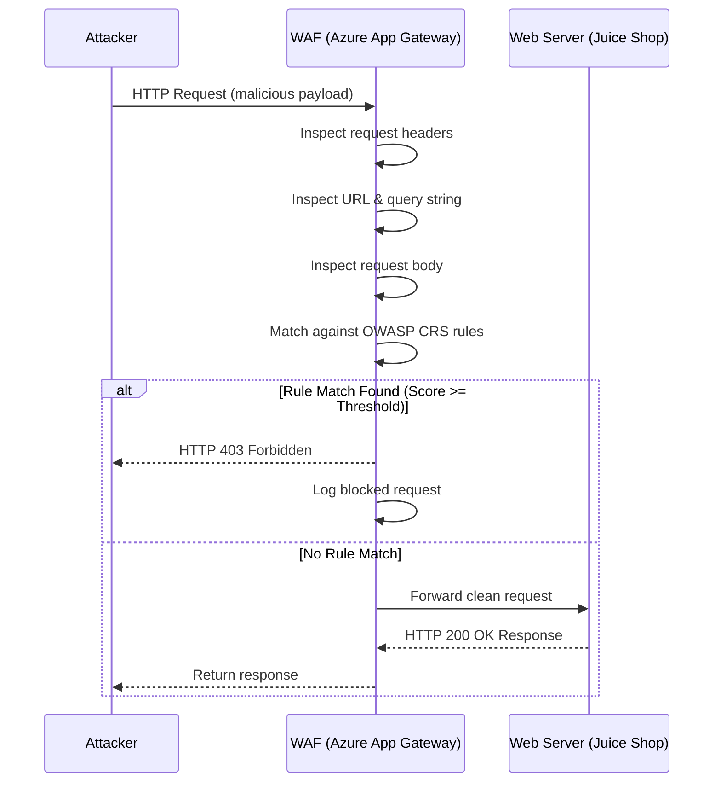
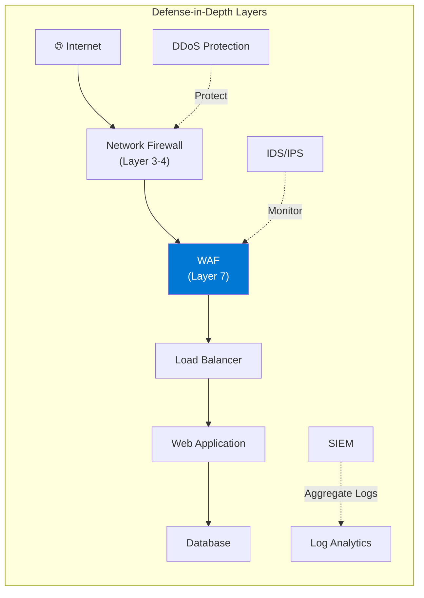
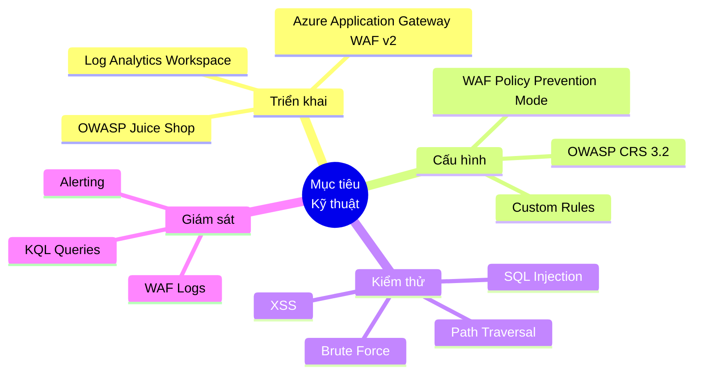

# 01 - Tổng quan Dự án

## Web Application Firewall (WAF) trên Microsoft Azure

---

## 1. Giới thiệu Web Application Firewall (WAF)

### 1.1 Định nghĩa

**Web Application Firewall (WAF)** là một giải pháp bảo mật hoạt động tại tầng ứng dụng (Layer 7) của mô hình OSI, có khả năng kiểm tra, lọc và chặn lưu lượng HTTP/HTTPS dựa trên các quy tắc bảo mật được định nghĩa trước.

Khác với firewall mạng truyền thống hoạt động ở tầng 3-4 (Network/Transport), WAF hiểu được ngữ nghĩa của giao thức HTTP và có thể phân tích:

- **URL và query string** trong request
- **HTTP headers** (User-Agent, Cookie, Referer, v.v.)
- **Request body** (POST data, JSON payload, form data)
- **Response body** và HTTP status codes

### 1.2 Cơ chế Hoạt động

### 1.3 Các Mô hình Triển khai WAF

| Mô hình | Vị trí | Ưu điểm | Nhược điểm |
|---------|--------|---------|----------|
| **Inline/Transparent** | Trước web server | Chặn real-time | Có thể là điểm single failure |
| **Reverse Proxy** | Giữa client và server | Ẩn backend IP | Tăng latency |
| **Cloud-based** | SaaS/PaaS | Dễ triển khai, scale | Phụ thuộc nhà cung cấp |
| **Out-of-band** | Song song traffic | Không ảnh hưởng luồng | Chỉ detect, không block |

**Azure Application Gateway WAF v2** thuộc mô hình **Cloud-based Reverse Proxy** — phù hợp nhất cho hệ thống triển khai trên Azure.

---

## 2. Vai trò của WAF trong Bảo mật Ứng dụng Web

### 2.1 Vị trí trong Defense-in-Depth

### 2.2 Những gì WAF Bảo vệ

WAF bảo vệ ứng dụng web trước:

| Tấn công | OWASP Category | WAF Có thể Chặn |
|----------|----------------|-----------------|
| SQL Injection | A03:2021 | ✅ Có |
| Cross-Site Scripting (XSS) | A03:2021 | ✅ Có |
| Path/Directory Traversal | A01:2021 | ✅ Có |
| Command Injection | A03:2021 | ✅ Có |
| Local File Inclusion (LFI) | A01:2021 | ✅ Có |
| Remote File Inclusion (RFI) | A05:2021 | ✅ Có |
| HTTP Protocol Violations | - | ✅ Có |
| Scanner Detection | - | ✅ Có |
| Brute Force (Rate Limiting) | A07:2021 | ✅ Có (Custom Rules) |
| DDoS Layer 7 | - | ⚠️ Hạn chế |
| Business Logic Flaws | - | ❌ Không |
| Broken Authentication | A07:2021 | ❌ Không |

### 2.3 Giới hạn của WAF

WAF **không thể** thay thế hoàn toàn:
- Secure coding practices
- Code review và SAST/DAST
- Penetration testing định kỳ
- Patch management
- Authentication & authorization design

---

## 3. Lý do Lựa chọn Azure WAF (Application Gateway WAF v2)

### 3.1 So sánh các Giải pháp WAF Trên thị trường

| Tiêu chí | Azure WAF v2 | AWS WAF | Cloudflare WAF | ModSecurity |
|----------|-------------|---------|---------------|-------------|
| **Triển khai** | Azure Native | AWS Native | Cloud/SaaS | On-premise/VM |
| **Managed Rules** | OWASP CRS 3.2 | AWS Managed Rules | Cloudflare Rulesets | Community Rules |
| **Custom Rules** | ✅ Đầy đủ | ✅ Đầy đủ | ✅ Đầy đủ | ✅ Đầy đủ |
| **Auto-scaling** | ✅ Tự động | ✅ Tự động | ✅ Tự động | ❌ Thủ công |
| **Log Integration** | Azure Monitor / Log Analytics | CloudWatch | Cloudflare Dashboard | ELK Stack |
| **SLA** | 99.95% | 99.95% | 99.99% | N/A |
| **Chi phí** | Pay-per-use | Pay-per-use | Subscription | Free + Infra |
| **Phù hợp đồ án** | ⭐⭐⭐⭐⭐ | ⭐⭐⭐ | ⭐⭐⭐ | ⭐⭐ |

### 3.2 Tính năng Nổi bật của Azure Application Gateway WAF v2

#### Autoscaling
- Tự động co giãn theo lưu lượng traffic
- Không cần pre-provision capacity
- Xử lý được traffic spike trong các cuộc tấn công DDoS

#### Zone Redundancy
- Hỗ trợ Availability Zones (AZ)
- High availability không cần cấu hình phức tạp

#### WAF Policy Separation
- WAF Policy tách biệt với Application Gateway config
- Có thể áp dụng nhiều WAF Policy cho nhiều site/listener

#### Integration với Azure Ecosystem
- **Azure Monitor** — metrics real-time
- **Log Analytics** — query logs với KQL
- **Azure Sentinel** — SIEM tích hợp
- **Azure Security Center** — security posture management
- **Azure AD** — authentication integration

#### OWASP Core Rule Set (CRS)
- Hỗ trợ CRS 3.2 (mới nhất)
- Managed bởi Microsoft
- Cập nhật định kỳ khi có CVE mới

### 3.3 Lý do Chọn cho Đồ án này

1. **Phù hợp môi trường**: Toàn bộ hạ tầng trên Azure → tích hợp native, không cần cấu hình phức tạp
2. **Dễ quan sát**: Log tích hợp sẵn vào Log Analytics, có thể query bằng KQL
3. **Thực tế doanh nghiệp**: Azure WAF là giải pháp được sử dụng rộng rãi trong production
4. **OWASP CRS**: Bộ quy tắc chuẩn công nghiệp, dễ giải thích trong báo cáo
5. **Portal UI**: Azure Portal cung cấp giao diện trực quan cho demo

---

## 4. Phạm vi Đồ án

### 4.1 Trong phạm vi (In-scope)

| Hạng mục | Chi tiết |
|----------|----------|
| **Hạ tầng Azure** | Resource Group, VNet, Subnet, NSG, Public IP |
| **Application Gateway** | WAF v2, Listener, Backend Pool, Routing Rule |
| **WAF Policy** | OWASP CRS 3.2, Custom Rules, Exclusions |
| **Target App** | OWASP Juice Shop trên Ubuntu VM |
| **Kiểm thử** | SQL Injection, XSS, Path Traversal, SQLMap, Brute Force |
| **Giám sát** | Azure Monitor, Log Analytics, KQL queries |
| **Phân tích** | So sánh kết quả có/không có WAF |

### 4.2 Ngoài phạm vi (Out-of-scope)

- Cấu hình HTTPS/TLS termination chi tiết (đề xuất nhưng không kiểm thử)
- Azure Front Door WAF
- DDoS Protection Standard
- Penetration testing production system
- Azure Sentinel SIEM configuration
- Multi-region deployment

### 4.3 Giới hạn Môi trường

- Môi trường lab/học thuật, không phải production
- OWASP Juice Shop là ứng dụng chủ đích có lỗ hổng (intentionally vulnerable)
- Kali Linux chạy trên mạng ngoài Azure (hoặc VM riêng biệt)

---

## 5. Mục tiêu Nghiên cứu

### 5.1 Mục tiêu Kỹ thuật

### 5.2 Mục tiêu Học thuật

1. **Hiểu sâu** cơ chế hoạt động của WAF tại Layer 7
2. **Thực hành** triển khai cloud security trên Azure
3. **Chứng minh** hiệu quả WAF qua dữ liệu thực nghiệm
4. **So sánh** hành vi hệ thống trước và sau khi có WAF
5. **Đề xuất** best practices cho WAF deployment

### 5.3 Câu hỏi Nghiên cứu

| # | Câu hỏi | Phương pháp Trả lời |
|---|---------|---------------------|
| 1 | WAF v2 chặn được bao nhiêu % các tấn công OWASP Top 10? | Kiểm thử và so sánh |
| 2 | False positive rate là bao nhiêu với traffic bình thường? | Test với normal requests |
| 3 | Latency thêm vào khi qua WAF là bao nhiêu? | Đo response time |
| 4 | Log Analytics có đủ thông tin để điều tra sự cố? | Phân tích WAF logs |
| 5 | Custom rules có cải thiện bảo vệ so với chỉ CRS? | So sánh detection rate |

---

## 6. Kết quả Dự kiến

Sau khi hoàn thành đồ án, hệ thống sẽ:

- ✅ Chặn **100%** SQL Injection cơ bản và nâng cao
- ✅ Chặn **100%** XSS (Reflected và Stored)
- ✅ Chặn **100%** Path Traversal
- ✅ Làm thất bại SQLMap automated scanning
- ✅ Giới hạn Brute Force qua Rate Limiting
- ✅ Ghi log đầy đủ trong Log Analytics
- ✅ Dashboard giám sát real-time

---

*Tài liệu tiếp theo: [02-requirements.md](02-requirements.md)*
