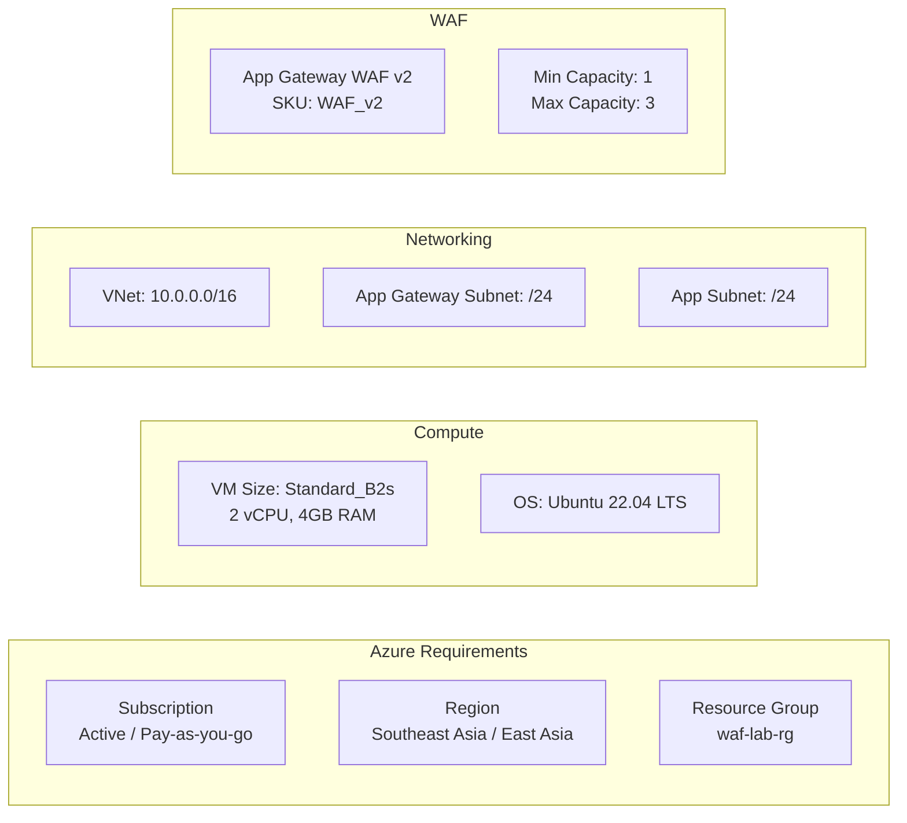

# 02 - Yêu cầu Hệ thống

## Requirements Specification

---

## 1. Tổng quan Yêu cầu

Tài liệu này mô tả đầy đủ các yêu cầu chức năng (Functional Requirements) và phi chức năng (Non-Functional Requirements) cho hệ thống WAF triển khai trên Azure bảo vệ OWASP Juice Shop.

### 1.1 Stakeholders

| Stakeholder | Vai trò | Yêu cầu chính |
|-------------|---------|---------------|
| **Security Engineer** | Triển khai và cấu hình WAF | WAF hoạt động đúng, log đầy đủ |
| **Developer** | Chủ sở hữu ứng dụng | Ứng dụng hoạt động bình thường, không bị block oan |
| **SOC Analyst** | Phân tích sự cố | Log chi tiết, query linh hoạt, alert kịp thời |
| **Auditor** | Kiểm tra tuân thủ | Báo cáo compliance, evidence về security control |

---

## 2. Functional Requirements (Yêu cầu Chức năng)

### FR-01: Bảo vệ Website

| ID | FR-01 |
|----|-------|
| **Tên** | Bảo vệ ứng dụng web OWASP Juice Shop |
| **Mô tả** | Hệ thống WAF phải hoạt động như một reverse proxy, tất cả traffic từ internet đến Juice Shop đều đi qua WAF |
| **Tiêu chí chấp nhận** | - Traffic đến Juice Shop bắt buộc qua Application Gateway WAF v2 |
| | - Backend VM không expose trực tiếp ra internet |
| | - NSG chỉ cho phép traffic từ Application Gateway subnet |
| **Mức độ ưu tiên** | Critical |

### FR-02: Chặn SQL Injection

| ID | FR-02 |
|----|-------|
| **Tên** | Phát hiện và chặn SQL Injection |
| **Mô tả** | WAF phải phát hiện và chặn các payload SQL Injection trong URL, query string, headers và request body |
| **Tiêu chí chấp nhận** | - Chặn `' OR 1=1 --` trong query string |
| | - Chặn `UNION SELECT` statement |
| | - Chặn `'; DROP TABLE` |
| | - Chặn các payload SQLMap tự động |
| | - Trả về HTTP 403 khi phát hiện SQLi |
| | - Ghi log vào Azure Log Analytics |
| **CRS Rules** | SQLI group (942xxx) |
| **Mức độ ưu tiên** | Critical |

### FR-03: Chặn Cross-Site Scripting (XSS)

| ID | FR-03 |
|----|-------|
| **Tên** | Phát hiện và chặn XSS |
| **Mô tả** | WAF phải phát hiện và chặn các payload XSS trong tất cả các vị trí của HTTP request |
| **Tiêu chí chấp nhận** | - Chặn `` |
| | - Chặn `` |
| | - Chặn event handler injection (`onmouseover`, `onclick`, v.v.) |
| | - Chặn JavaScript URI (`javascript:alert(1)`) |
| | - Trả về HTTP 403 khi phát hiện XSS |
| **CRS Rules** | XSS group (941xxx) |
| **Mức độ ưu tiên** | Critical |

### FR-04: Chặn Path Traversal

| ID | FR-04 |
|----|-------|
| **Tên** | Phát hiện và chặn Path Traversal / Directory Traversal |
| **Mô tả** | WAF phải phát hiện các chuỗi traversal trong URL và parameters |
| **Tiêu chí chấp nhận** | - Chặn `../../../etc/passwd` |
| | - Chặn `..%2F..%2F..%2Fetc%2Fpasswd` (URL encoded) |
| | - Chặn `....//....//etc/passwd` (double encoding) |
| | - Trả về HTTP 403 |
| **CRS Rules** | LFI group (930xxx) |
| **Mức độ ưu tiên** | High |

### FR-05: Phát hiện và Chặn Scanner

| ID | FR-05 |
|----|-------|
| **Tên** | Phát hiện automated scanner và attack tools |
| **Mô tả** | WAF phải phát hiện dấu hiệu của automated scanning tools |
| **Tiêu chí chấp nhận** | - Phát hiện SQLMap User-Agent |
| | - Phát hiện Nikto, Nmap, Acunetix signatures |
| | - Log scanner activity |
| **CRS Rules** | Scanner Detection (913xxx) |
| **Mức độ ưu tiên** | High |

### FR-06: Logging Đầy đủ

| ID | FR-06 |
|----|-------|
| **Tên** | Ghi log tất cả sự kiện WAF |
| **Mô tả** | Mọi request bị block và detect phải được ghi log đầy đủ |
| **Tiêu chí chấp nhận** | - Log ghi vào Azure Log Analytics Workspace |
| | - Log bao gồm: timestamp, source IP, HTTP method, URI, matched rule ID, action taken |
| | - Retention tối thiểu 30 ngày |
| | - Log available trong vòng 5 phút sau sự kiện |
| **Mức độ ưu tiên** | Critical |

### FR-07: Monitoring Real-time

| ID | FR-07 |
|----|-------|
| **Tên** | Giám sát real-time |
| **Mô tả** | Hệ thống phải cung cấp monitoring dashboard real-time |
| **Tiêu chí chấp nhận** | - Azure Monitor Metrics hiển thị: Total Requests, Blocked Requests, Healthy Host Count |
| | - Dashboard trong Azure Portal |
| | - Dữ liệu cập nhật mỗi 1 phút |
| **Mức độ ưu tiên** | High |

### FR-08: Alerting

| ID | FR-08 |
|----|-------|
| **Tên** | Cảnh báo khi phát hiện tấn công |
| **Mô tả** | Hệ thống phải tạo alert khi số lượng blocked requests vượt ngưỡng |
| **Tiêu chí chấp nhận** | - Alert khi blocked requests > 10 trong 5 phút |
| | - Notification qua email hoặc Azure Action Group |
| | - Alert severity phù hợp (Warning/Critical) |
| **Mức độ ưu tiên** | Medium |

---

## 3. Non-Functional Requirements (Yêu cầu Phi chức năng)

### NFR-01: Security (Bảo mật)

| ID | NFR-01 |
|----|--------|
| **Tên** | Tiêu chuẩn bảo mật |
| **Yêu cầu** | Hệ thống phải tuân thủ các tiêu chuẩn bảo mật sau |
| **Tiêu chí** | - WAF Policy chạy ở **Prevention Mode** (không chỉ Detection) |
| | - OWASP CRS 3.2 được kích hoạt đầy đủ |
| | - Backend VM không có Public IP |
| | - NSG chỉ cho phép inbound từ Application Gateway |
| | - Admin access qua Azure Bastion hoặc VPN |
| | - Không expose port 3000 trực tiếp ra internet |
| **Metric** | 0 critical vulnerabilities trong network config |

### NFR-02: Availability (Tính sẵn sàng)

| ID | NFR-02 |
|----|--------|
| **Tên** | Tính sẵn sàng của hệ thống |
| **Yêu cầu** | Hệ thống phải đạt uptime cao |
| **Tiêu chí** | - Application Gateway WAF v2: SLA 99.95% |
| | - Auto-scaling đảm bảo không bị overload |
| | - Health probe tự động phát hiện backend không healthy |
| **Metric** | Uptime ≥ 99.9% trong thời gian kiểm thử |

### NFR-03: Performance (Hiệu năng)

| ID | NFR-03 |
|----|--------|
| **Tên** | Hiệu năng hệ thống |
| **Yêu cầu** | WAF không được làm giảm hiệu năng đáng kể |
| **Tiêu chí** | - Latency thêm vào do WAF: ≤ 50ms (p99) |
| | - Throughput: ≥ 1000 requests/second |
| | - Response time cho normal request: ≤ 500ms |
| **Baseline** | Đo performance không có WAF, so sánh sau khi bật WAF |

### NFR-04: Reliability (Độ tin cậy)

| ID | NFR-04 |
|----|--------|
| **Tên** | Độ tin cậy WAF |
| **Yêu cầu** | WAF phải hoạt động ổn định, không bỏ sót tấn công |
| **Tiêu chí** | - Detection rate: ≥ 95% với OWASP CRS test cases |
| | - False positive rate: ≤ 5% với normal traffic |
| | - No crashes hoặc service interruption trong 24h test |
| **Metric** | Tỷ lệ phát hiện qua kiểm thử thực tế |

### NFR-05: Scalability (Khả năng mở rộng)

| ID | NFR-05 |
|----|--------|
| **Tên** | Khả năng mở rộng |
| **Yêu cầu** | Kiến trúc phải dễ dàng mở rộng |
| **Tiêu chí** | - Application Gateway v2 hỗ trợ autoscaling |
| | - Có thể thêm backend VM vào pool |
| | - WAF Policy có thể áp dụng cho nhiều sites |
| | - Hỗ trợ thêm Custom Rules không downtime |

---

## 4. Yêu cầu Môi trường Kiểm thử

### 4.1 Môi trường Azure

### 4.2 Yêu cầu Attacker Machine

| Thành phần | Yêu cầu |
|------------|---------|
| **OS** | Kali Linux 2023.x hoặc mới hơn |
| **Tools** | SQLMap, Hydra, Burp Suite Community, curl, nikto |
| **Network** | Có kết nối internet đến Azure Public IP |
| **Browser** | Firefox với FoxyProxy extension |

### 4.3 Constraints

| Constraint | Mô tả |
|-----------|-------|
| **Budget** | Sử dụng Azure Free Tier hoặc Student subscription khi có thể |
| **SKU** | WAF_v2 (bắt buộc cho WAF features) |
| **Region** | Chọn region gần Việt Nam để giảm latency khi demo |
| **OWASP CRS** | Phải dùng CRS 3.2, không dùng 2.x |

---

## 5. Ma trận Yêu cầu - Kiểm thử

| Requirement ID | Tên | Test Case | File |
|----------------|-----|-----------|------|
| FR-02 | SQL Injection | TC-SQL-01 đến TC-SQL-05 | 10-sql-injection-test.md |
| FR-03 | XSS | TC-XSS-01 đến TC-XSS-04 | 11-xss-test.md |
| FR-04 | Path Traversal | TC-PATH-01 đến TC-PATH-03 | 12-path-traversal-test.md |
| FR-02 | SQLMap | TC-SQLMAP-01 đến TC-SQLMAP-02 | 13-sqlmap-test.md |
| FR-08 | Brute Force | TC-BF-01 đến TC-BF-02 | 14-brute-force-test.md |
| FR-06 | Logging | TC-LOG-01 | 08-monitoring-logging.md |
| FR-07 | Monitoring | TC-MON-01 | 08-monitoring-logging.md |

---

*Tài liệu tiếp theo: [03-threat-model.md](03-threat-model.md)*
