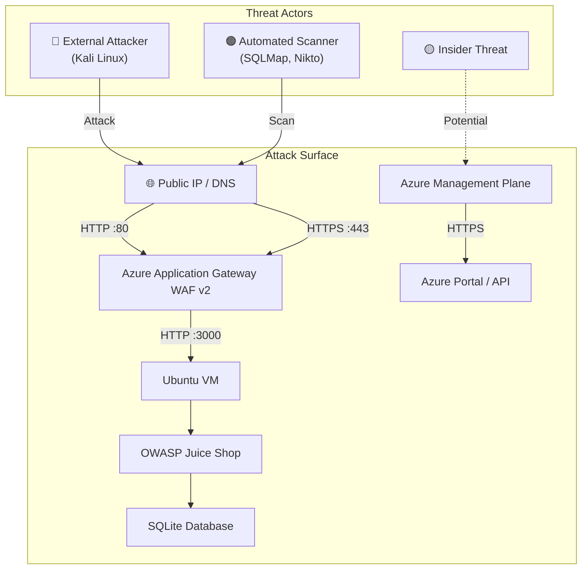
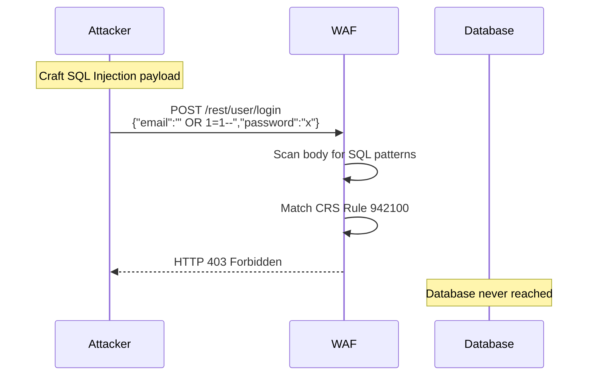
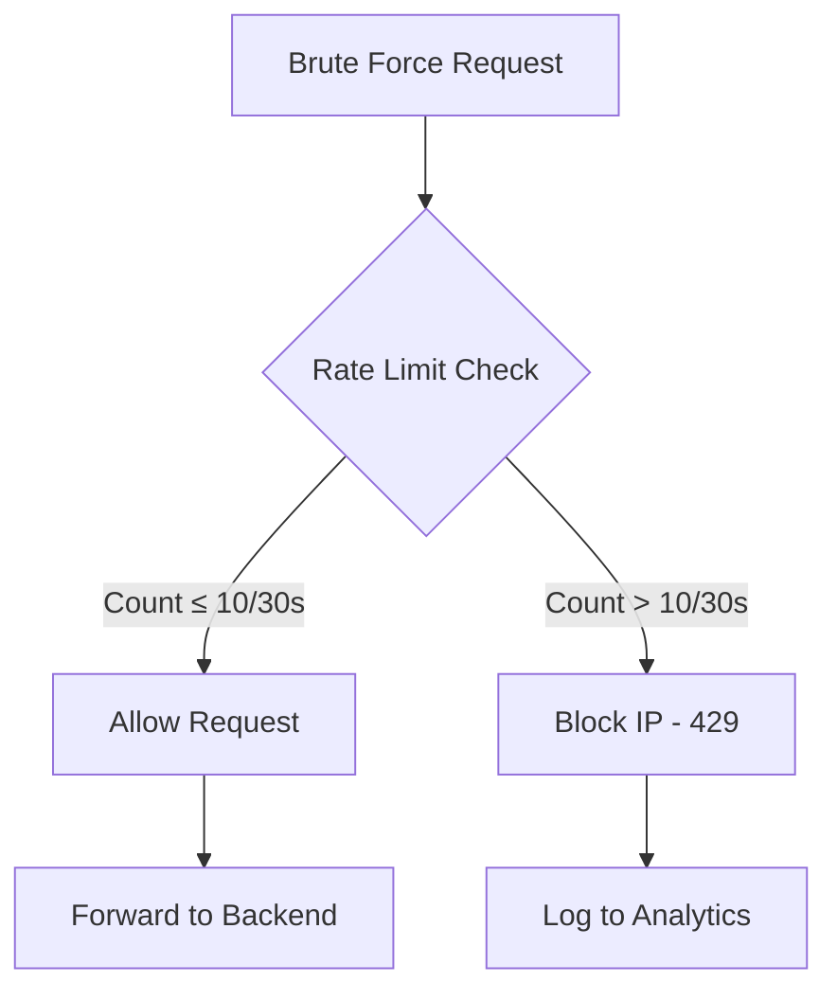
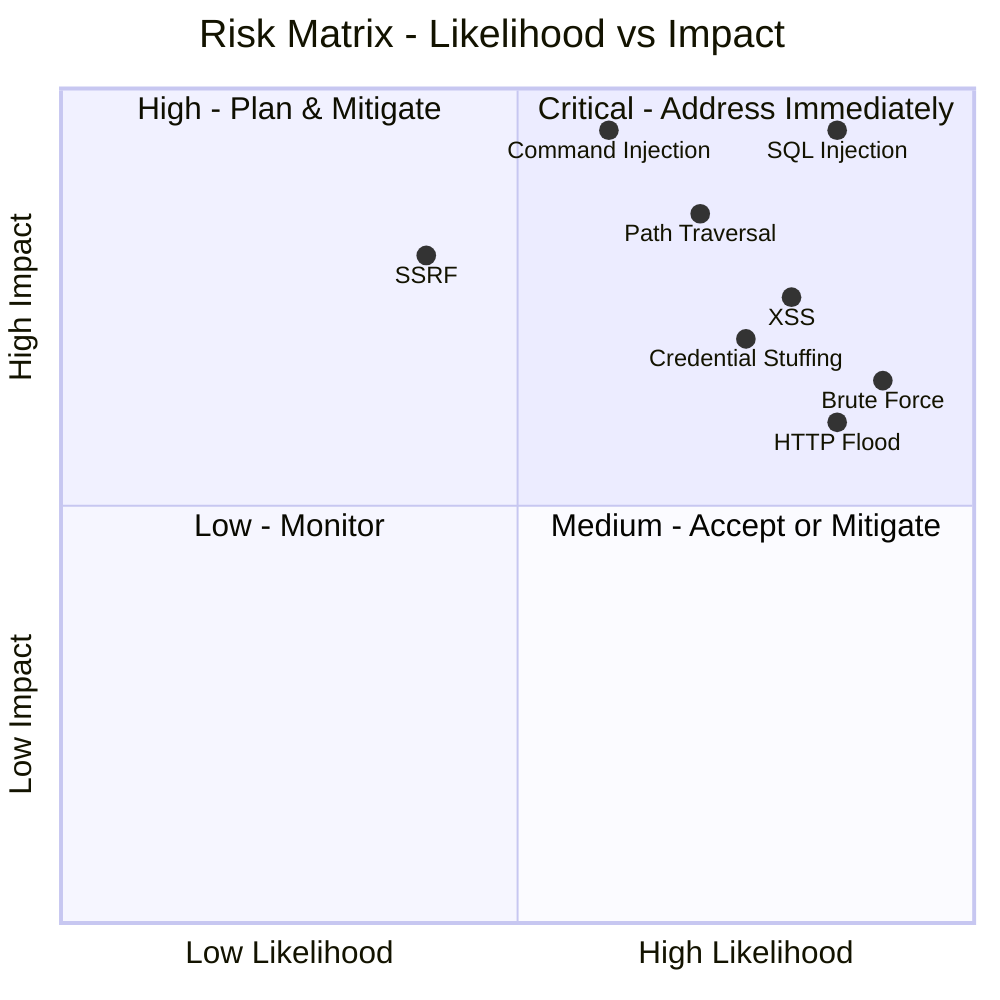
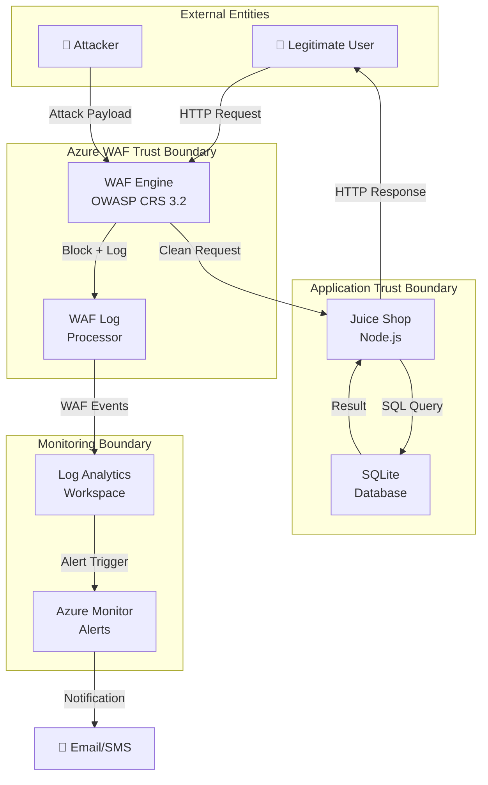

# 03 - Mô hình Mối đe dọa (Threat Model)

## STRIDE & OWASP Top 10 Analysis

---

## 1. Phương pháp Threat Modeling

Tài liệu này sử dụng kết hợp hai phương pháp:
- **STRIDE** (Spoofing, Tampering, Repudiation, Information Disclosure, DoS, Elevation of Privilege)
- **OWASP Top 10 2021** — tiêu chuẩn phân loại rủi ro web application

### 1.1 Attack Surface



---

## 2. OWASP Top 10 2021 - Phân tích Chi tiết

### 2.1 A01:2021 - Broken Access Control

| Thuộc tính | Chi tiết |
|------------|----------|
| **Mô tả** | Người dùng có thể truy cập tài nguyên ngoài phạm vi được phép; admin functions accessible to regular users |
| **Ảnh hưởng với Juice Shop** | Truy cập `/administration`, xem orders của user khác, IDOR vulnerabilities |
| **Mức độ rủi ro** | 🔴 Critical |
| **Vector tấn công** | Thay đổi ID trong URL, thao túng JWT token, forced browsing |
| **WAF có chặn được?** | ⚠️ Hạn chế — WAF không hiểu business logic |
| **Biện pháp giảm thiểu** | Authorization checks trong code, JWT validation, WAF Custom Rules cho admin paths |

**Ví dụ tấn công với Juice Shop:**
```http
GET /rest/user/1/order HTTP/1.1
Host: <app-gateway-ip>
Authorization: Bearer <normal_user_jwt>

# Thay đổi user ID → truy cập order của user khác
GET /rest/user/2/order HTTP/1.1
```

### 2.2 A02:2021 - Cryptographic Failures

| Thuộc tính | Chi tiết |
|------------|----------|
| **Mô tả** | Dữ liệu nhạy cảm không được mã hóa đúng cách, sử dụng thuật toán yếu |
| **Ảnh hưởng với Juice Shop** | Password lưu dạng MD5, không dùng HTTPS, token predictable |
| **Mức độ rủi ro** | 🔴 High |
| **WAF có chặn được?** | ❌ Không — đây là lỗi thiết kế, không phải input attack |
| **Biện pháp giảm thiểu** | HTTPS (TLS 1.2+), bcrypt cho passwords, Azure Key Vault |

### 2.3 A03:2021 - Injection ⭐ (Trọng tâm đồ án)

#### SQL Injection

| Thuộc tính | Chi tiết |
|------------|----------|
| **Mô tả** | Attacker inject SQL code vào input fields, thao túng truy vấn database |
| **Ảnh hưởng với Juice Shop** | Bypass authentication, dump toàn bộ user table, xóa dữ liệu |
| **Mức độ rủi ro** | 🔴 Critical |
| **Payload mẫu** | `' OR '1'='1`, `'; DROP TABLE Users--`, `' UNION SELECT email,password,3 FROM Users--` |
| **WAF có chặn được?** | ✅ Có — CRS Rule Group 942xxx |
| **Evidence** | WAF log hiển thị rule 942100, 942200 triggered |

**Attack flow:**


#### Command Injection

| Thuộc tính | Chi tiết |
|------------|----------|
| **Mô tả** | Inject OS commands thông qua application inputs |
| **Ảnh hưởng** | Remote code execution, server takeover |
| **Payload mẫu** | `; cat /etc/passwd`, `| whoami`, `` `id` `` |
| **Mức độ rủi ro** | 🔴 Critical |
| **WAF có chặn được?** | ✅ Có — CRS Rule Group 932xxx |

### 2.4 A04:2021 - Insecure Design

| Thuộc tính | Chi tiết |
|------------|----------|
| **Mô tả** | Lỗi trong thiết kế kiến trúc, thiếu threat modeling |
| **WAF có chặn được?** | ❌ Không |
| **Biện pháp** | Secure design patterns, threat modeling, security requirements |

### 2.5 A05:2021 - Security Misconfiguration

| Thuộc tính | Chi tiết |
|------------|----------|
| **Mô tả** | Cấu hình sai: default credentials, unnecessary features enabled, verbose error messages |
| **Ảnh hưởng với Juice Shop** | Error messages lộ stack trace, debug endpoints exposed |
| **Mức độ rủi ro** | 🟠 High |
| **WAF có chặn được?** | ⚠️ Một phần — có thể ẩn error responses |
| **Biện pháp** | Custom error pages, disable debug mode, Azure Security Center recommendations |

### 2.6 A06:2021 - Vulnerable Components

| Thuộc tính | Chi tiết |
|------------|----------|
| **Mô tả** | Sử dụng thư viện/framework có lỗ hổng đã biết |
| **Ảnh hưởng** | RCE qua CVE trong Node.js packages |
| **WAF có chặn được?** | ⚠️ Có thể block exploit attempts |
| **Biện pháp** | Cập nhật dependencies, SCA scanning, virtual patching qua WAF |

### 2.7 A07:2021 - Identification and Authentication Failures ⭐

#### Brute Force Attack

| Thuộc tính | Chi tiết |
|------------|----------|
| **Mô tả** | Tấn công đoán mật khẩu bằng cách thử nhiều lần |
| **Ảnh hưởng với Juice Shop** | Compromise user accounts, admin access |
| **Mức độ rủi ro** | 🟠 High |
| **Công cụ** | Hydra, Burp Suite Intruder |
| **WAF có chặn được?** | ✅ Có — Rate Limiting Custom Rule |
| **Biện pháp** | Custom Rule: block IP sau 10 requests/30s đến `/rest/user/login` |



### 2.8 A08:2021 - Software and Data Integrity Failures

| Thuộc tính | Chi tiết |
|------------|----------|
| **Mô tả** | Untrusted data deserialization, CI/CD pipeline attacks |
| **WAF có chặn được?** | ⚠️ Một phần — Java deserialization payloads |
| **Biện pháp** | Input validation, integrity checks |

### 2.9 A09:2021 - Security Logging and Monitoring Failures

| Thuộc tính | Chi tiết |
|------------|----------|
| **Mô tả** | Không có logging đầy đủ, không detect breach kịp thời |
| **Giải pháp trong đồ án** | Azure Monitor + Log Analytics + KQL queries + Alerts |
| **Biện pháp** | Diagnostic Settings trên App Gateway, retention 90 ngày |

### 2.10 A10:2021 - Server-Side Request Forgery (SSRF)

| Thuộc tính | Chi tiết |
|------------|----------|
| **Mô tả** | Attacker khiến server thực hiện HTTP request đến internal services |
| **Ảnh hưởng** | Access Azure metadata service (`169.254.169.254`), internal network scanning |
| **Mức độ rủi ro** | 🟠 High |
| **WAF có chặn được?** | ⚠️ Có thể block với Custom Rules |
| **Payload mẫu** | `url=http://169.254.169.254/metadata/identity` |

---

## 3. Phân tích Mối đe dọa Bổ sung

### 3.1 Path / Directory Traversal ⭐

| Thuộc tính | Chi tiết |
|------------|----------|
| **Mô tả** | Attacker navigate ra ngoài web root để đọc file hệ thống |
| **Mục tiêu** | `/etc/passwd`, `/etc/shadow`, application source code, config files |
| **Mức độ rủi ro** | 🔴 Critical |
| **Payload mẫu** | `../../../../etc/passwd`, `..%2F..%2F..%2Fetc%2Fpasswd` |
| **WAF Rule** | CRS 930100, 930110, 930120 |
| **Evidence** | WAF log: ruleId "930100", action "Block" |

### 3.2 Local File Inclusion (LFI)

| Thuộc tính | Chi tiết |
|------------|----------|
| **Mô tả** | Include local files vào response thông qua vulnerable parameters |
| **Payload mẫu** | `?page=../../../../etc/passwd`, `?template=/etc/shadow` |
| **Mức độ rủi ro** | 🔴 Critical |
| **WAF Rule** | CRS 930100-930130 |

### 3.3 HTTP Flood / Layer 7 DoS

| Thuộc tính | Chi tiết |
|------------|----------|
| **Mô tả** | Gửi số lượng lớn HTTP requests để làm quá tải server |
| **Ảnh hưởng** | Service unavailable, 503 errors |
| **Mức độ rủi ro** | 🟠 High |
| **WAF có chặn được?** | ⚠️ Hạn chế — cần Azure DDoS Standard hoặc Rate Limiting |
| **Custom Rule** | Rate limit: block IP gửi > 100 requests/minute |

### 3.4 Credential Stuffing

| Thuộc tính | Chi tiết |
|------------|----------|
| **Mô tả** | Sử dụng username/password từ data breach khác để đăng nhập |
| **Mức độ rủi ro** | 🟠 High |
| **WAF có chặn được?** | ⚠️ Rate limiting giảm thiểu |
| **Biện pháp thêm** | MFA, account lockout, Azure AD Identity Protection |

---

## 4. Risk Matrix



---

## 5. Threat Mitigation Summary

| Mối đe dọa | Mức độ rủi ro | WAF Chặn? | CRS Rules | Custom Rules | Residual Risk |
|------------|--------------|-----------|-----------|--------------|---------------|
| SQL Injection | 🔴 Critical | ✅ Có | 942xxx | - | 🟢 Thấp |
| XSS | 🔴 High | ✅ Có | 941xxx | - | 🟢 Thấp |
| Path Traversal | 🔴 Critical | ✅ Có | 930xxx | - | 🟢 Thấp |
| Command Injection | 🔴 Critical | ✅ Có | 932xxx | - | 🟢 Thấp |
| LFI | 🔴 Critical | ✅ Có | 930xxx | - | 🟢 Thấp |
| Brute Force | 🟠 High | ✅ Có | - | Rate Limit | 🟡 Trung bình |
| HTTP Flood | 🟠 High | ⚠️ Có thể | - | Rate Limit | 🟡 Trung bình |
| SSRF | 🟠 High | ⚠️ Một phần | - | Block IMDS | 🟡 Trung bình |
| Broken Access Control | 🔴 Critical | ❌ Không | - | - | 🔴 Cao |
| Crypto Failures | 🟠 High | ❌ Không | - | - | 🟠 Cao |

---

## 6. Data Flow Diagram (DFD) Level 1



---

*Tài liệu tiếp theo: [04-architecture.md](04-architecture.md)*
