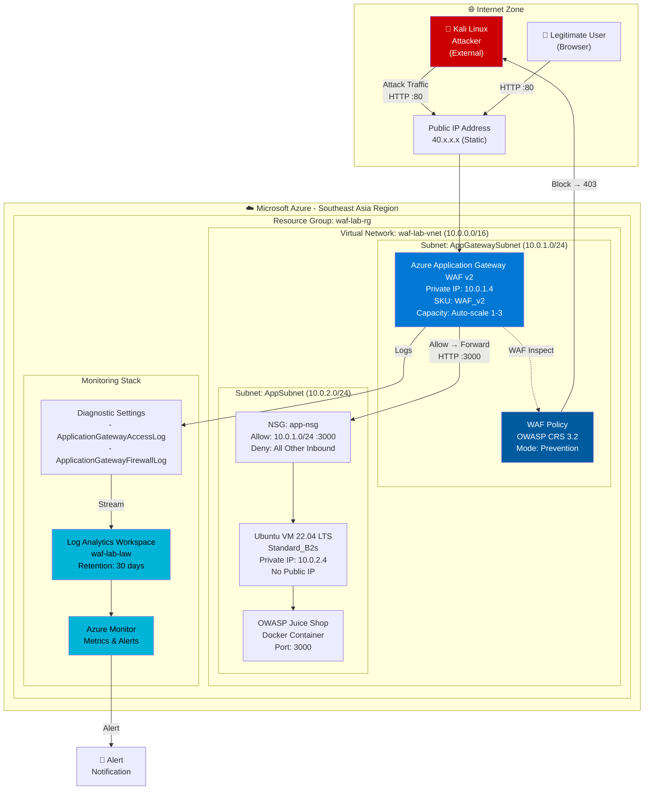
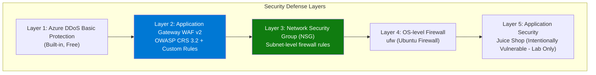
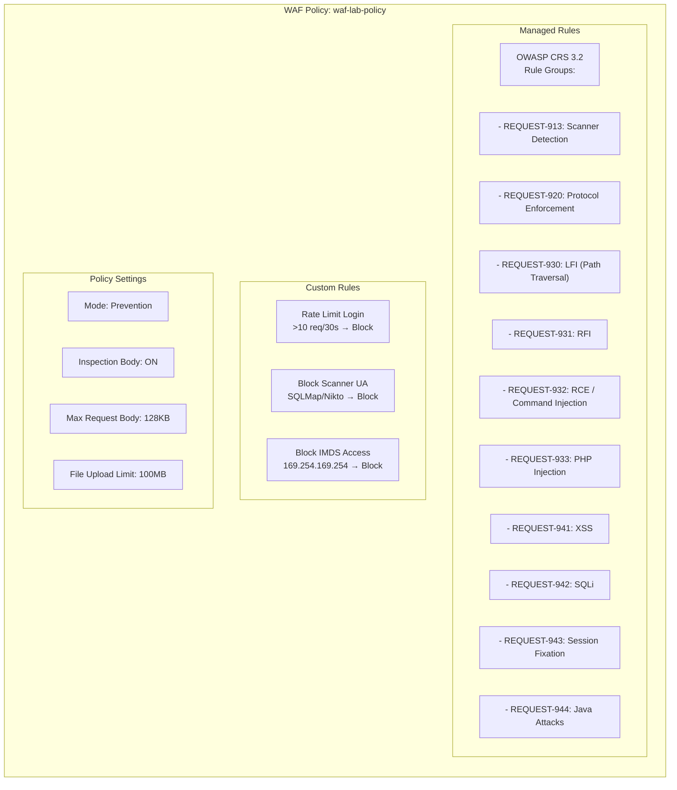
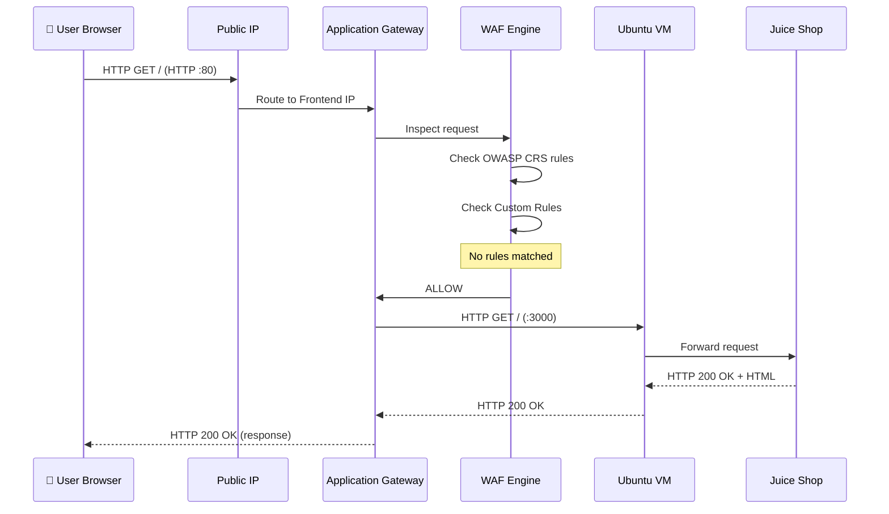
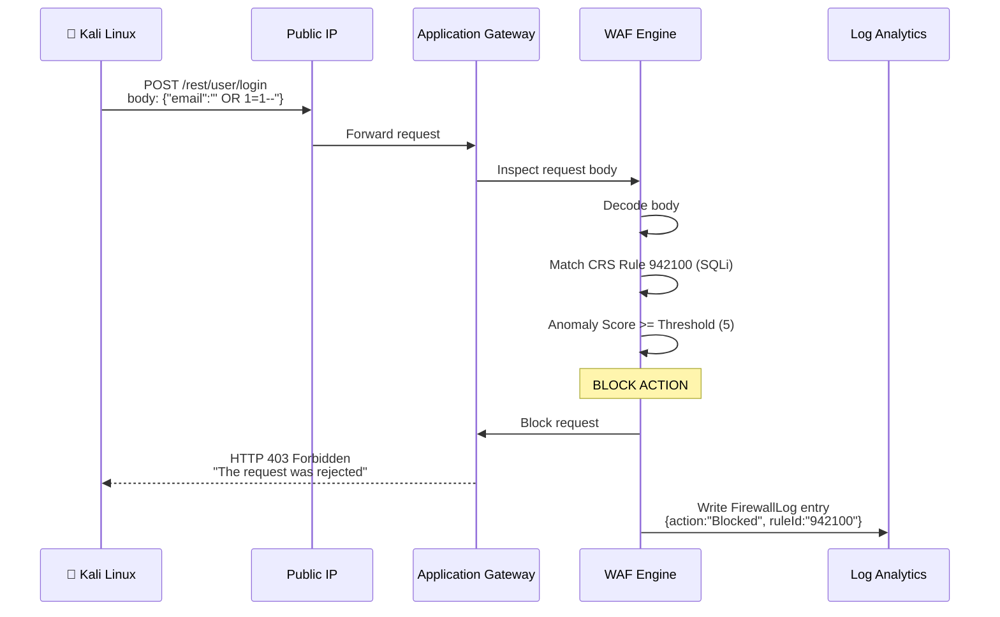
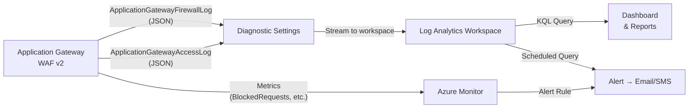
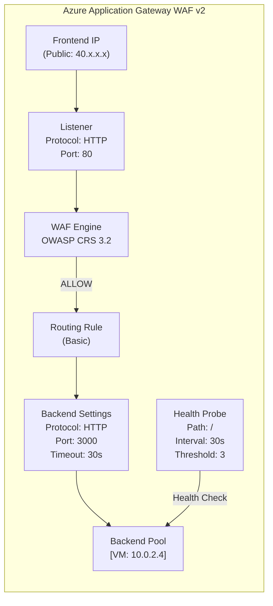
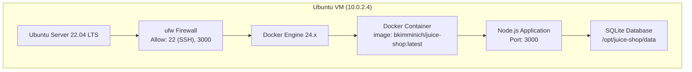
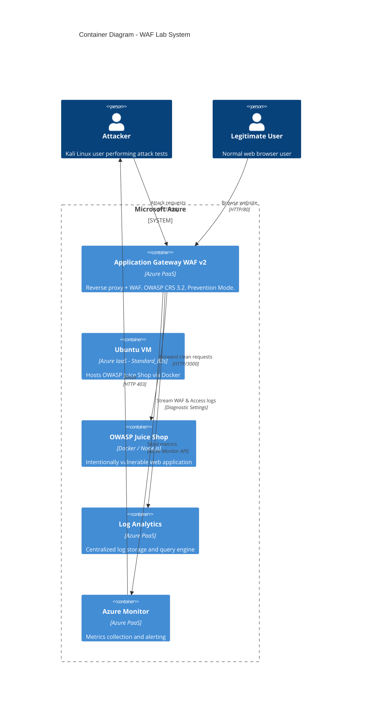

# 04 - Kiến trúc Hệ thống

## System Architecture Design

---

## 1. Kiến trúc Tổng thể (Overall Architecture)



---

## 2. Network Architecture

### 2.1 Network Topology

```mermaid
graph LR
    subgraph "Internet"
        EXT["External Traffic\n0.0.0.0/0"]
    end

    subgraph "Azure VNet: 10.0.0.0/16"
        subgraph "AppGatewaySubnet\n10.0.1.0/24"
            AGW["Application Gateway\nWAF v2\n10.0.1.4"]
        end

        subgraph "AppSubnet\n10.0.2.0/24"
            VM["Ubuntu VM\n10.0.2.4"]
        end

        subgraph "AzureFirewallSubnet\n(Reserved - Future)"]
            FW["Azure Firewall\n(Not Deployed)"]
        end
    end

    EXT -->|":80, :443"| AGW
    AGW -->|":3000\n(Internal only)"| VM
    VM -.->|"No direct\nInternet access"| EXT

    style AGW fill:#0078d4,color:#fff
    style VM fill:#107c10,color:#fff
    style FW fill:#888,color:#fff
```

### 2.2 Subnet Design

| Subnet | CIDR | Mục đích | NSG |
|--------|------|----------|-----|
| `AppGatewaySubnet` | 10.0.1.0/24 | Azure Application Gateway | Không bắt buộc* |
| `AppSubnet` | 10.0.2.0/24 | Ubuntu VM + Juice Shop | `app-nsg` |
| `AzureBastionSubnet` | 10.0.3.0/27 | Azure Bastion (optional) | Managed by Azure |

> *Application Gateway Subnet không cần NSG theo Microsoft recommendation, nhưng Azure tự quản lý security.

### 2.3 NSG Rules — `app-nsg`

| Priority | Name | Direction | Protocol | Source | Destination | Port | Action |
|----------|------|-----------|----------|--------|-------------|------|--------|
| 100 | Allow-AGW-Inbound | Inbound | TCP | 10.0.1.0/24 | 10.0.2.0/24 | 3000 | Allow |
| 110 | Allow-SSH-Bastion | Inbound | TCP | 10.0.3.0/27 | 10.0.2.4 | 22 | Allow |
| 200 | Allow-AGW-Probe | Inbound | TCP | 10.0.1.0/24 | 10.0.2.4 | 3000 | Allow |
| 4096 | Deny-All-Inbound | Inbound | Any | * | * | * | Deny |

---

## 3. Security Architecture

### 3.1 Security Layers



### 3.2 WAF Policy Structure



### 3.3 Zero Trust Principles Applied

| Principle | Áp dụng trong đồ án |
|-----------|---------------------|
| **Verify explicitly** | Mọi request đều được WAF inspect |
| **Least privilege** | VM không có Public IP, NSG chỉ allow port 3000 từ AGW subnet |
| **Assume breach** | Log Analytics ghi lại tất cả activity, alert khi phát hiện attack |

---

## 4. Data Flow Architecture

### 4.1 Legitimate Traffic Flow



### 4.2 Attack Traffic Flow (SQL Injection)



### 4.3 Logging Data Flow



---

## 5. Component Architecture

### 5.1 Application Gateway Internal Components



### 5.2 Ubuntu VM Component Stack



---

## 6. Deployment Architecture Diagram



---

## 7. High Availability Consideration

Đây là môi trường lab, HA không phải mục tiêu chính. Tuy nhiên, Application Gateway WAF v2 đã có sẵn:

| Feature | Application Gateway WAF v2 | Ghi chú |
|---------|---------------------------|---------|
| **Autoscaling** | ✅ Min 1, Max 10 instances | Cấu hình Min=1 cho lab |
| **Zone Redundancy** | ✅ Availability Zones | Kích hoạt nếu region hỗ trợ |
| **Health Probes** | ✅ Tự động | Phát hiện VM down |
| **Backend HA** | ❌ Single VM | Lab chỉ cần 1 VM |

---

*Tài liệu tiếp theo: [05-azure-resource-design.md](05-azure-resource-design.md)*
