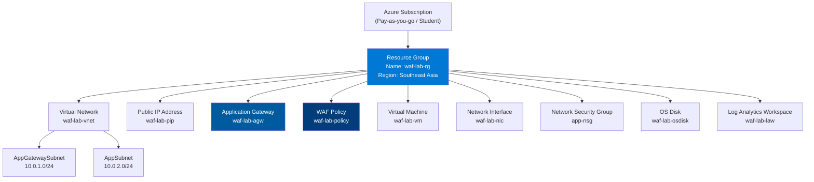

# 05 - Thiết kế Tài nguyên Azure

## Azure Resource Design & Configuration

---

## 1. Resource Hierarchy



---

## 2. Resource Group

| Thuộc tính | Giá trị |
|------------|---------|
| **Name** | `waf-lab-rg` |
| **Region** | `Southeast Asia` (Singapore) |
| **Tags** | `Project: WAF-Lab`, `Environment: Lab`, `Owner: Student` |

---

## 3. Virtual Network

| Thuộc tính | Giá trị |
|------------|---------|
| **Name** | `waf-lab-vnet` |
| **Address Space** | `10.0.0.0/16` |
| **Region** | Southeast Asia |
| **DNS Servers** | Default (Azure-provided) |

### Subnets

| Subnet Name | CIDR | Mục đích | Delegation |
|-------------|------|----------|-----------|
| `AppGatewaySubnet` | `10.0.1.0/24` | Application Gateway WAF v2 | None (Required name for AGW) |
| `AppSubnet` | `10.0.2.0/24` | Ubuntu VM | None |
| `AzureBastionSubnet` | `10.0.3.0/27` | Azure Bastion (optional admin access) | None |

> ⚠️ Lưu ý: Subnet cho Application Gateway phải đặt tên **chính xác** là `AppGatewaySubnet` hoặc bất kỳ tên nào nhưng phải là `/24` hoặc lớn hơn. Microsoft khuyến nghị `/24`.

---

## 4. Public IP Address

| Thuộc tính | Giá trị |
|------------|---------|
| **Name** | `waf-lab-pip` |
| **SKU** | Standard (bắt buộc cho WAF v2) |
| **Assignment** | Static |
| **DNS Label** | `waf-lab-demo` (tạo hostname: `waf-lab-demo.southeastasia.cloudapp.azure.com`) |
| **Zone** | Zone-redundant |
| **Tier** | Regional |

---

## 5. Application Gateway WAF v2

### 5.1 Configuration Summary

| Thuộc tính | Giá trị |
|------------|---------|
| **Name** | `waf-lab-agw` |
| **Region** | Southeast Asia |
| **Tier** | WAF V2 |
| **Capacity** | Autoscaling: Min=1, Max=3 |
| **WAF Policy** | `waf-lab-policy` |
| **Virtual Network** | `waf-lab-vnet` |
| **Subnet** | `AppGatewaySubnet` |
| **Public IP** | `waf-lab-pip` |

### 5.2 Frontend IP Configuration

| Name | Type | IP Address |
|------|------|-----------|
| `appGwPublicFrontendIp` | Public | Assigned from `waf-lab-pip` |

### 5.3 Backend Pool

| Thuộc tính | Giá trị |
|------------|---------|
| **Name** | `juiceshop-backend-pool` |
| **Type** | IP Address |
| **Target** | `10.0.2.4` (Ubuntu VM private IP) |

### 5.4 Backend HTTP Settings

| Thuộc tính | Giá trị |
|------------|---------|
| **Name** | `juiceshop-http-settings` |
| **Protocol** | HTTP |
| **Port** | 3000 |
| **Cookie-based affinity** | Disabled |
| **Request timeout** | 30 seconds |
| **Override backend path** | (empty) |

### 5.5 HTTP Listener

| Thuộc tính | Giá trị |
|------------|---------|
| **Name** | `http-listener` |
| **Frontend IP** | `appGwPublicFrontendIp` |
| **Protocol** | HTTP |
| **Port** | 80 |
| **Host name** | (blank — accept all) |

### 5.6 Routing Rule

| Thuộc tính | Giá trị |
|------------|---------|
| **Name** | `juiceshop-routing-rule` |
| **Rule type** | Basic |
| **Listener** | `http-listener` |
| **Backend target** | `juiceshop-backend-pool` |
| **Backend settings** | `juiceshop-http-settings` |

### 5.7 Health Probe

| Thuộc tính | Giá trị |
|------------|---------|
| **Name** | `juiceshop-health-probe` |
| **Protocol** | HTTP |
| **Host** | (use backend settings host) |
| **Path** | `/` |
| **Interval** | 30 seconds |
| **Timeout** | 30 seconds |
| **Unhealthy threshold** | 3 |
| **HTTP Status Codes** | 200-399 |

---

## 6. WAF Policy

### 6.1 Policy Settings

| Thuộc tính | Giá trị |
|------------|---------|
| **Name** | `waf-lab-policy` |
| **Type** | WAF Policy (Regional) |
| **Mode** | Prevention |
| **Inspection Body** | Enabled |
| **Max Request Body Size** | 128 KB |
| **Max File Upload Size** | 100 MB |
| **Request Body Inspection** | Enabled |

### 6.2 Managed Rule Sets

| Rule Set | Version | Status |
|----------|---------|--------|
| OWASP CRS | 3.2 | Enabled |
| Microsoft Bot Manager | 1.0 | Optional |

### 6.3 OWASP CRS 3.2 Rule Groups

| Rule Group | ID Range | Bảo vệ | Status |
|------------|----------|--------|--------|
| General | 900xxx | General protocol validation | Enabled |
| Method Enforcement | 911xxx | HTTP method validation | Enabled |
| Scanner Detection | 913xxx | Automated scanner detection | Enabled |
| Protocol Enforcement | 920xxx | HTTP protocol compliance | Enabled |
| Protocol Attack | 921xxx | HTTP protocol attacks | Enabled |
| Application Attack LFI | 930xxx | Local File Inclusion / Path Traversal | Enabled |
| Application Attack RFI | 931xxx | Remote File Inclusion | Enabled |
| Application Attack RCE | 932xxx | Remote Code Execution / Command Injection | Enabled |
| Application Attack PHP | 933xxx | PHP injection attacks | Enabled |
| Application Attack Node.js | 934xxx | Node.js specific attacks | Enabled |
| Application Attack XSS | 941xxx | Cross-Site Scripting | Enabled |
| Application Attack SQLi | 942xxx | SQL Injection | Enabled |
| Application Attack Session Fixation | 943xxx | Session fixation | Enabled |
| Application Attack Java | 944xxx | Java deserialization | Enabled |

### 6.4 Custom Rules

| Rule Name | Priority | Condition | Action |
|-----------|----------|-----------|--------|
| `BlockSQLMapUA` | 10 | `RequestHeaders[User-Agent]` contains `sqlmap` | Block |
| `BlockNiktoUA` | 11 | `RequestHeaders[User-Agent]` contains `Nikto` | Block |
| `RateLimitLogin` | 20 | `RequestUri` ends with `/rest/user/login` AND rate > 10/30s | Block |
| `BlockIMDS` | 30 | `RequestBody` contains `169.254.169.254` | Block |

---

## 7. Ubuntu Virtual Machine

| Thuộc tính | Giá trị |
|------------|---------|
| **Name** | `waf-lab-vm` |
| **Region** | Southeast Asia |
| **Size** | Standard_B2s (2 vCPU, 4 GB RAM) |
| **OS** | Ubuntu Server 22.04 LTS (Gen2) |
| **Authentication** | SSH Public Key |
| **Username** | `azureuser` |
| **Public IP** | None (no public IP) |
| **VNet/Subnet** | `waf-lab-vnet` / `AppSubnet` |
| **Private IP** | `10.0.2.4` (Static) |
| **NSG** | `app-nsg` |
| **OS Disk** | Standard SSD 30 GB |
| **Auto-shutdown** | 23:00 UTC (tiết kiệm chi phí) |

---

## 8. Network Security Group (NSG)

### app-nsg — Inbound Rules

| Priority | Name | Source | Source Port | Destination | Dest Port | Protocol | Action |
|----------|------|--------|------------|-------------|-----------|----------|--------|
| 100 | `Allow-AGW-HTTP` | `10.0.1.0/24` | Any | `10.0.2.4` | 3000 | TCP | Allow |
| 110 | `Allow-Bastion-SSH` | `AzureBastionSubnet` | Any | `10.0.2.4` | 22 | TCP | Allow |
| 120 | `Allow-AGW-Probe` | `AzureLoadBalancer` | Any | `10.0.2.4` | 65200-65535 | TCP | Allow |
| 4096 | `DenyAllInbound` | Any | Any | Any | Any | Any | Deny |

### app-nsg — Outbound Rules

| Priority | Name | Source | Destination | Port | Protocol | Action |
|----------|------|--------|-------------|------|----------|--------|
| 100 | `Allow-Internet` | `10.0.2.0/24` | Internet | 80,443 | TCP | Allow |
| 200 | `Allow-AzureServices` | Any | AzureCloud | Any | Any | Allow |
| 4096 | `DenyAllOutbound` | Any | Any | Any | Any | Deny |

---

## 9. Log Analytics Workspace

| Thuộc tính | Giá trị |
|------------|---------|
| **Name** | `waf-lab-law` |
| **Region** | Southeast Asia |
| **Pricing Tier** | Pay-as-you-go (PerGB2018) |
| **Retention** | 30 days |
| **Daily Cap** | 1 GB (tránh chi phí cao) |

### Connected Data Sources

| Source | Data Type | Table in Log Analytics |
|--------|-----------|------------------------|
| Application Gateway | WAF Firewall Log | `AzureDiagnostics` (Category: ApplicationGatewayFirewallLog) |
| Application Gateway | Access Log | `AzureDiagnostics` (Category: ApplicationGatewayAccessLog) |
| Application Gateway | Performance Log | `AzureDiagnostics` (Category: ApplicationGatewayPerformanceLog) |
| Azure Monitor | Metrics | `AzureMetrics` |

---

## 10. Cost Estimation (Ước tính Chi phí Lab)

| Resource | SKU | Đơn giá (ước tính) | 1 tháng lab |
|----------|-----|-------------------|-------------|
| Application Gateway WAF v2 | WAF_v2, 1 CU | ~$0.144/hour + $0.008/CU | ~$12-20 |
| Ubuntu VM | Standard_B2s | ~$0.0416/hour | ~$30 |
| Public IP (Static) | Standard | ~$0.004/hour | ~$3 |
| Log Analytics | 1 GB/day | ~$2.30/GB | ~$5 |
| Storage (Disk) | Standard SSD 30GB | ~$1.5/month | ~$1.5 |
| **Total** | | | **~$50-60/month** |

> 💡 Sử dụng **Azure Student Credit ($100)** hoặc **Free Trial ($200)** để tiết kiệm chi phí trong thời gian làm đồ án.

---

## 11. Tagging Strategy

Tất cả resources được tag theo chuẩn:

```json
{
  "Project": "WAF-Lab",
  "Environment": "Lab",
  "Owner": "StudentName",
  "Department": "Security",
  "CostCenter": "Academic"
}
```

---

*Tài liệu tiếp theo: [06-deployment-guide.md](06-deployment-guide.md)*
