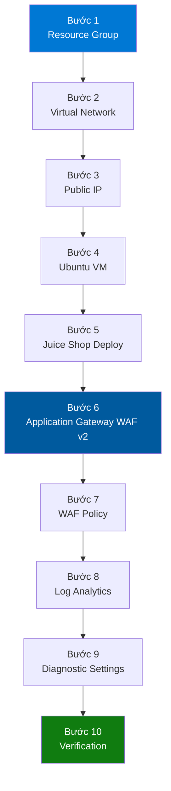

# 06 - Hướng dẫn Triển khai

## Step-by-Step Deployment Guide on Azure

---

## 1. Tổng quan Quy trình Triển khai



### Prerequisites

| Yêu cầu | Chi tiết |
|---------|----------|
| **Azure Subscription** | Pay-as-you-go, Student hoặc Free Trial |
| **Azure CLI** | Phiên bản 2.50+ (`az --version`) |
| **Quyền** | Contributor hoặc Owner trên Subscription |
| **Region** | Southeast Asia (Singapore) |
| **Budget** | ~$50-60 cho 1 tháng lab |

---

## 2. Bước 1 — Tạo Resource Group

### Azure Portal

1. Truy cập [portal.azure.com](https://portal.azure.com)
2. Tìm kiếm **"Resource groups"** → **Create**
3. Điền thông tin:
   - **Subscription**: Chọn subscription của bạn
   - **Resource group name**: `waf-lab-rg`
   - **Region**: `Southeast Asia`
4. Tab **Tags**: Thêm tags
5. Click **Review + Create** → **Create**

### Azure CLI

```bash
az group create \
  --name waf-lab-rg \
  --location southeastasia \
  --tags Project=WAF-Lab Environment=Lab Owner=Student
```

### Verification

```bash
az group show --name waf-lab-rg --output table
```

---

## 3. Bước 2 — Tạo Virtual Network và Subnets

### Azure Portal

1. Tìm **"Virtual networks"** → **Create**
2. **Basics**:
   - Resource group: `waf-lab-rg`
   - Name: `waf-lab-vnet`
   - Region: `Southeast Asia`
3. **IP Addresses**:
   - IPv4 address space: `10.0.0.0/16`
   - Xóa subnet mặc định, thêm 3 subnets mới

### Subnet Configuration

| Subnet Name | Address Range | Mục đích |
|-------------|--------------|----------|
| `AppGatewaySubnet` | `10.0.1.0/24` | Application Gateway |
| `AppSubnet` | `10.0.2.0/24` | Ubuntu VM |
| `AzureBastionSubnet` | `10.0.3.0/27` | Bastion (optional) |

### Azure CLI

```bash
# Tạo VNet
az network vnet create \
  --resource-group waf-lab-rg \
  --name waf-lab-vnet \
  --address-prefix 10.0.0.0/16 \
  --location southeastasia

# Tạo AppGatewaySubnet
az network vnet subnet create \
  --resource-group waf-lab-rg \
  --vnet-name waf-lab-vnet \
  --name AppGatewaySubnet \
  --address-prefix 10.0.1.0/24

# Tạo AppSubnet
az network vnet subnet create \
  --resource-group waf-lab-rg \
  --vnet-name waf-lab-vnet \
  --name AppSubnet \
  --address-prefix 10.0.2.0/24

# Tạo AzureBastionSubnet
az network vnet subnet create \
  --resource-group waf-lab-rg \
  --vnet-name waf-lab-vnet \
  --name AzureBastionSubnet \
  --address-prefix 10.0.3.0/27
```

---

## 4. Bước 3 — Tạo Public IP Address

### Azure Portal

1. Tìm **"Public IP addresses"** → **Create**
2. Điền:
   - Name: `waf-lab-pip`
   - SKU: **Standard**
   - Assignment: **Static**
   - DNS label: `waf-lab-demo`
   - Region: `Southeast Asia`

### Azure CLI

```bash
az network public-ip create \
  --resource-group waf-lab-rg \
  --name waf-lab-pip \
  --sku Standard \
  --allocation-method Static \
  --dns-name waf-lab-demo \
  --location southeastasia \
  --zone 1 2 3
```

### Lấy Public IP sau khi tạo

```bash
az network public-ip show \
  --resource-group waf-lab-rg \
  --name waf-lab-pip \
  --query ipAddress \
  --output tsv
```

---

## 5. Bước 4 — Tạo Network Security Group (NSG)

### Azure CLI

```bash
# Tạo NSG
az network nsg create \
  --resource-group waf-lab-rg \
  --name app-nsg \
  --location southeastasia

# Rule 100: Allow từ AppGatewaySubnet vào port 3000
az network nsg rule create \
  --resource-group waf-lab-rg \
  --nsg-name app-nsg \
  --name Allow-AGW-HTTP \
  --priority 100 \
  --direction Inbound \
  --source-address-prefixes 10.0.1.0/24 \
  --destination-port-ranges 3000 \
  --protocol TCP \
  --access Allow

# Rule 110: Allow SSH từ Bastion
az network nsg rule create \
  --resource-group waf-lab-rg \
  --nsg-name app-nsg \
  --name Allow-Bastion-SSH \
  --priority 110 \
  --direction Inbound \
  --source-address-prefixes 10.0.3.0/27 \
  --destination-port-ranges 22 \
  --protocol TCP \
  --access Allow

# Rule 120: Allow AGW Health Probe
az network nsg rule create \
  --resource-group waf-lab-rg \
  --nsg-name app-nsg \
  --name Allow-AGW-Probe \
  --priority 120 \
  --direction Inbound \
  --source-address-prefixes AzureLoadBalancer \
  --destination-port-ranges "65200-65535" \
  --protocol TCP \
  --access Allow

# Rule 4096: Deny All
az network nsg rule create \
  --resource-group waf-lab-rg \
  --nsg-name app-nsg \
  --name DenyAllInbound \
  --priority 4096 \
  --direction Inbound \
  --source-address-prefixes "*" \
  --destination-port-ranges "*" \
  --protocol "*" \
  --access Deny
```


---

## 6. Bước 5 — Tạo Ubuntu VM

### Azure Portal

1. Tìm **"Virtual machines"** → **Create** → **Azure virtual machine**
2. **Basics**:
   - Resource group: `waf-lab-rg`
   - VM name: `waf-lab-vm`
   - Region: `Southeast Asia`
   - Image: `Ubuntu Server 22.04 LTS - Gen2`
   - Size: `Standard_B2s`
   - Authentication: `SSH public key`
   - Username: `azureuser`
3. **Networking**:
   - VNet: `waf-lab-vnet`
   - Subnet: `AppSubnet`
   - Public IP: **None** ← Quan trọng!
   - NIC NSG: `Advanced` → chọn `app-nsg`
4. **Management**: Bật **Auto-shutdown** lúc 23:00 UTC

### Azure CLI

```bash
# Tạo SSH key (nếu chưa có)
ssh-keygen -t rsa -b 4096 -f ~/.ssh/waf-lab-key

# Tạo VM
az vm create \
  --resource-group waf-lab-rg \
  --name waf-lab-vm \
  --image Ubuntu2204 \
  --size Standard_B2s \
  --admin-username azureuser \
  --ssh-key-value ~/.ssh/waf-lab-key.pub \
  --vnet-name waf-lab-vnet \
  --subnet AppSubnet \
  --nsg app-nsg \
  --public-ip-address "" \
  --private-ip-address 10.0.2.4 \
  --location southeastasia \
  --os-disk-size-gb 30 \
  --storage-sku StandardSSD_LRS

# Bật auto-shutdown
az vm auto-shutdown \
  --resource-group waf-lab-rg \
  --name waf-lab-vm \
  --time 2300
```

### Verification

```bash
az vm show \
  --resource-group waf-lab-rg \
  --name waf-lab-vm \
  --query "{name:name, privateIP:privateIps, status:powerState}" \
  --show-details \
  --output table
```

> ⚠️ VM không có Public IP — chỉ truy cập qua Azure Bastion hoặc sau khi có Application Gateway.

---

## 7. Bước 6 — Cài đặt Docker và Deploy Juice Shop

### Kết nối vào VM qua Azure Bastion

1. Azure Portal → `waf-lab-vm` → **Connect** → **Bastion**
2. Nhập username: `azureuser`
3. Upload SSH private key

### Hoặc dùng Azure CLI Serial Console (không cần Bastion)

```bash
az serial-console connect \
  --resource-group waf-lab-rg \
  --name waf-lab-vm
```

### Cài Docker trên Ubuntu 22.04

```bash
# Cập nhật system
sudo apt-get update && sudo apt-get upgrade -y

# Cài dependencies
sudo apt-get install -y \
  ca-certificates curl gnupg lsb-release

# Thêm Docker GPG key
sudo mkdir -p /etc/apt/keyrings
curl -fsSL https://download.docker.com/linux/ubuntu/gpg | \
  sudo gpg --dearmor -o /etc/apt/keyrings/docker.gpg

# Thêm Docker repository
echo \
  "deb [arch=$(dpkg --print-architecture) \
  signed-by=/etc/apt/keyrings/docker.gpg] \
  https://download.docker.com/linux/ubuntu \
  $(lsb_release -cs) stable" | \
  sudo tee /etc/apt/sources.list.d/docker.list > /dev/null

# Cài Docker Engine
sudo apt-get update
sudo apt-get install -y docker-ce docker-ce-cli containerd.io

# Cho phép user không cần sudo
sudo usermod -aG docker azureuser
newgrp docker

# Kiểm tra Docker
docker --version
```

### Deploy OWASP Juice Shop

```bash
# Pull image
docker pull bkimminich/juice-shop:latest

# Chạy container
docker run -d \
  --name juice-shop \
  --restart always \
  -p 3000:3000 \
  bkimminich/juice-shop:latest

# Kiểm tra container đang chạy
docker ps

# Kiểm tra logs
docker logs juice-shop --tail 20

# Test local
curl -I http://localhost:3000
# Expected: HTTP/1.1 200 OK
```

### Cấu hình ufw Firewall

```bash
# Bật ufw
sudo ufw enable

# Allow SSH (quan trọng - không bị lock out)
sudo ufw allow 22/tcp

# Allow Juice Shop từ AppGatewaySubnet
sudo ufw allow from 10.0.1.0/24 to any port 3000

# Kiểm tra rules
sudo ufw status verbose
```


---

## 8. Bước 7 — Tạo Application Gateway WAF v2

### 8.1 Tạo WAF Policy Trước

#### Azure Portal

1. Tìm **"Web Application Firewall policies"** → **Create**
2. **Basics**:
   - Policy name: `waf-lab-policy`
   - Policy for: `Regional WAF (Application Gateway)`
   - Resource group: `waf-lab-rg`
   - Location: `Southeast Asia`
3. **Policy settings**:
   - Mode: **Prevention**
   - Inspection body: **Enabled**
   - Max request body size: `128 KB`
4. **Managed rules**:
   - Rule set: **OWASP CRS 3.2**
   - Status: Enabled
5. Click **Review + Create** → **Create**

#### Azure CLI

```bash
# Tạo WAF Policy
az network application-gateway waf-policy create \
  --resource-group waf-lab-rg \
  --name waf-lab-policy \
  --location southeastasia

# Set Prevention Mode
az network application-gateway waf-policy policy-setting update \
  --policy-name waf-lab-policy \
  --resource-group waf-lab-rg \
  --mode Prevention \
  --state Enabled \
  --request-body-check true \
  --max-request-body-size-kb 128 \
  --file-upload-limit-mb 100

# Thêm OWASP CRS 3.2
az network application-gateway waf-policy managed-rule rule-set add \
  --policy-name waf-lab-policy \
  --resource-group waf-lab-rg \
  --type OWASP \
  --version 3.2
```

### 8.2 Tạo Application Gateway WAF v2

#### Azure Portal

1. Tìm **"Application gateways"** → **Create**
2. **Basics**:
   - Name: `waf-lab-agw`
   - Tier: **WAF V2**
   - Enable autoscaling: **Yes**
   - Min capacity: `1`, Max: `3`
   - WAF Policy: `waf-lab-policy`
   - Region: `Southeast Asia`
   - VNet: `waf-lab-vnet`
   - Subnet: `AppGatewaySubnet`
3. **Frontends**:
   - Frontend IP type: **Public**
   - Public IP: `waf-lab-pip`
4. **Backends**:
   - Add backend pool: `juiceshop-backend-pool`
   - Target: IP `10.0.2.4`
5. **Configuration** (Routing rule):
   - Rule name: `juiceshop-routing-rule`
   - Listener: `http-listener` (HTTP, port 80)
   - Backend target: `juiceshop-backend-pool`
   - HTTP settings: `juiceshop-http-settings` (HTTP, port 3000, timeout 30s)
6. Click **Review + Create** → **Create**

> ⏱️ Quá trình tạo Application Gateway mất khoảng **15-20 phút**.

#### Azure CLI (Tạo từng thành phần)

```bash
# Tạo Application Gateway WAF v2
az network application-gateway create \
  --resource-group waf-lab-rg \
  --name waf-lab-agw \
  --location southeastasia \
  --sku WAF_v2 \
  --capacity 1 \
  --vnet-name waf-lab-vnet \
  --subnet AppGatewaySubnet \
  --public-ip-address waf-lab-pip \
  --http-settings-port 3000 \
  --http-settings-protocol Http \
  --frontend-port 80 \
  --routing-rule-type Basic \
  --servers 10.0.2.4 \
  --waf-policy waf-lab-policy \
  --priority 100

# Đổi tên backend pool
az network application-gateway address-pool update \
  --gateway-name waf-lab-agw \
  --resource-group waf-lab-rg \
  --name appGatewayBackendPool \
  --servers 10.0.2.4
```

### 8.3 Thêm Custom Rules vào WAF Policy

```bash
# Rule 1: Block SQLMap User-Agent
az network application-gateway waf-policy custom-rule create \
  --policy-name waf-lab-policy \
  --resource-group waf-lab-rg \
  --name BlockSQLMapUA \
  --priority 10 \
  --rule-type MatchRule \
  --action Block

az network application-gateway waf-policy custom-rule match-condition add \
  --policy-name waf-lab-policy \
  --resource-group waf-lab-rg \
  --rule-name BlockSQLMapUA \
  --match-variable RequestHeaders \
  --selector User-Agent \
  --operator Contains \
  --values "sqlmap"

# Rule 2: Block Nikto Scanner
az network application-gateway waf-policy custom-rule create \
  --policy-name waf-lab-policy \
  --resource-group waf-lab-rg \
  --name BlockNiktoUA \
  --priority 11 \
  --rule-type MatchRule \
  --action Block

az network application-gateway waf-policy custom-rule match-condition add \
  --policy-name waf-lab-policy \
  --resource-group waf-lab-rg \
  --rule-name BlockNiktoUA \
  --match-variable RequestHeaders \
  --selector User-Agent \
  --operator Contains \
  --values "Nikto"
```


---

## 9. Bước 8 — Tạo Log Analytics Workspace

### Azure Portal

1. Tìm **"Log Analytics workspaces"** → **Create**
2. Điền:
   - Name: `waf-lab-law`
   - Resource group: `waf-lab-rg`
   - Region: `Southeast Asia`
   - Pricing tier: `Pay-as-you-go`
3. **Review + Create** → **Create**

### Azure CLI

```bash
az monitor log-analytics workspace create \
  --resource-group waf-lab-rg \
  --workspace-name waf-lab-law \
  --location southeastasia \
  --sku PerGB2018 \
  --retention-time 30

# Lấy Workspace ID và Key (dùng cho agent nếu cần)
az monitor log-analytics workspace show \
  --resource-group waf-lab-rg \
  --workspace-name waf-lab-law \
  --query "{id:customerId, name:name}" \
  --output table
```

---

## 10. Bước 9 — Cấu hình Diagnostic Settings

Đây là bước **quan trọng nhất** để WAF logs được gửi vào Log Analytics.

### Azure Portal

1. Vào `waf-lab-agw` → **Diagnostic settings** → **Add diagnostic setting**
2. Điền:
   - Name: `agw-to-law`
3. Chọn logs:
   - ✅ `ApplicationGatewayAccessLog`
   - ✅ `ApplicationGatewayPerformanceLog`
   - ✅ `ApplicationGatewayFirewallLog`
4. Metrics:
   - ✅ `AllMetrics`
5. Destination:
   - ✅ **Send to Log Analytics workspace**
   - Workspace: `waf-lab-law`
6. Click **Save**

### Azure CLI

```bash
# Lấy Resource ID của Application Gateway
AGW_ID=$(az network application-gateway show \
  --resource-group waf-lab-rg \
  --name waf-lab-agw \
  --query id --output tsv)

# Lấy Resource ID của Log Analytics
LAW_ID=$(az monitor log-analytics workspace show \
  --resource-group waf-lab-rg \
  --workspace-name waf-lab-law \
  --query id --output tsv)

# Tạo Diagnostic Settings
az monitor diagnostic-settings create \
  --name agw-to-law \
  --resource $AGW_ID \
  --workspace $LAW_ID \
  --logs '[
    {"category":"ApplicationGatewayAccessLog","enabled":true},
    {"category":"ApplicationGatewayPerformanceLog","enabled":true},
    {"category":"ApplicationGatewayFirewallLog","enabled":true}
  ]' \
  --metrics '[{"category":"AllMetrics","enabled":true}]'
```

---

## 11. Bước 10 — Verification & Testing

### 11.1 Kiểm tra Application Gateway

```bash
# Kiểm tra trạng thái AGW
az network application-gateway show \
  --resource-group waf-lab-rg \
  --name waf-lab-agw \
  --query "operationalState" \
  --output tsv
# Expected: Running

# Kiểm tra backend health
az network application-gateway show-backend-health \
  --resource-group waf-lab-rg \
  --name waf-lab-agw \
  --output table
# Expected: Healthy
```

### 11.2 Test Juice Shop Qua WAF

```bash
# Lấy Public IP của Application Gateway
PIP=$(az network public-ip show \
  --resource-group waf-lab-rg \
  --name waf-lab-pip \
  --query ipAddress --output tsv)

echo "Application Gateway IP: $PIP"

# Test 1: Normal request (phải trả về 200)
curl -I http://$PIP/
# Expected: HTTP/1.1 200 OK

# Test 2: SQL Injection (phải bị block - 403)
curl -I "http://$PIP/rest/products/search?q=' OR 1=1--"
# Expected: HTTP/1.1 403 Forbidden

# Test 3: XSS (phải bị block - 403)
curl -I "http://$PIP/search?q=<script>alert(1)</script>"
# Expected: HTTP/1.1 403 Forbidden

# Test 4: Path Traversal (phải bị block - 403)
curl -I "http://$PIP/../../../../etc/passwd"
# Expected: HTTP/1.1 403 Forbidden
```

### 11.3 Kiểm tra WAF Logs trong Log Analytics

1. Azure Portal → **Log Analytics workspaces** → `waf-lab-law`
2. Chọn **Logs**
3. Chạy KQL query:

```kusto
AzureDiagnostics
| where Category == "ApplicationGatewayFirewallLog"
| where action_s == "Blocked"
| project TimeGenerated, clientIp_s, requestUri_s, ruleId_s, action_s
| order by TimeGenerated desc
| take 20
```

> ⏱️ Logs thường xuất hiện trong Log Analytics sau **3-5 phút** từ khi có event.

### 11.4 Checklist Hoàn tất Triển khai

| # | Hạng mục | Trạng thái |
|---|----------|-----------|
| 1 | Resource Group tạo thành công | ☐ |
| 2 | VNet + Subnets đúng CIDR | ☐ |
| 3 | VM không có Public IP | ☐ |
| 4 | Juice Shop chạy trên port 3000 | ☐ |
| 5 | Application Gateway trạng thái Running | ☐ |
| 6 | Backend Health: Healthy | ☐ |
| 7 | WAF Policy: Prevention Mode | ☐ |
| 8 | OWASP CRS 3.2 Enabled | ☐ |
| 9 | Normal request trả về 200 | ☐ |
| 10 | SQL Injection bị block 403 | ☐ |
| 11 | XSS bị block 403 | ☐ |
| 12 | Logs xuất hiện trong Log Analytics | ☐ |

---

## 12. Troubleshooting

### Vấn đề thường gặp

| Vấn đề | Nguyên nhân | Giải pháp |
|--------|------------|----------|
| Backend health: Unhealthy | Juice Shop chưa chạy hoặc sai port | SSH vào VM, kiểm tra `docker ps` |
| 502 Bad Gateway | VM không nhận traffic từ AGW | Kiểm tra NSG rules, port 3000 |
| WAF không block | WAF Policy ở Detection mode | Chuyển sang Prevention mode |
| Logs không có trong LAW | Diagnostic settings chưa cấu hình | Tạo lại Diagnostic Settings |
| AGW creation failed | Subnet không đủ IPs hoặc sai tên | Subnet cần `/24`, đúng tên `AppGatewaySubnet` |
| 403 trên normal requests | False positive từ WAF rules | Tạo Exclusion rule trong WAF Policy |

### Debug Commands

```bash
# Kiểm tra NSG rules
az network nsg rule list \
  --resource-group waf-lab-rg \
  --nsg-name app-nsg \
  --output table

# Kiểm tra WAF Policy mode
az network application-gateway waf-policy show \
  --resource-group waf-lab-rg \
  --name waf-lab-policy \
  --query "policySettings" \
  --output json

# Xem WAF logs real-time trong Log Analytics
# Query:
# AzureDiagnostics
# | where Category == "ApplicationGatewayFirewallLog"
# | order by TimeGenerated desc
# | take 50
```

---

*Tài liệu tiếp theo: [07-waf-configuration.md](07-waf-configuration.md)*
