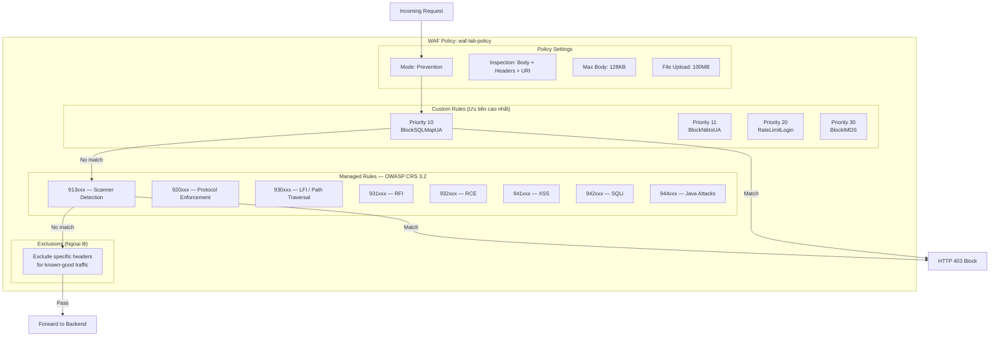
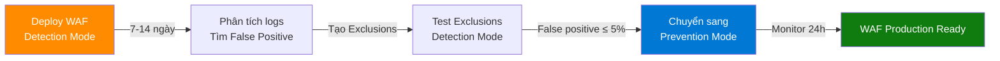
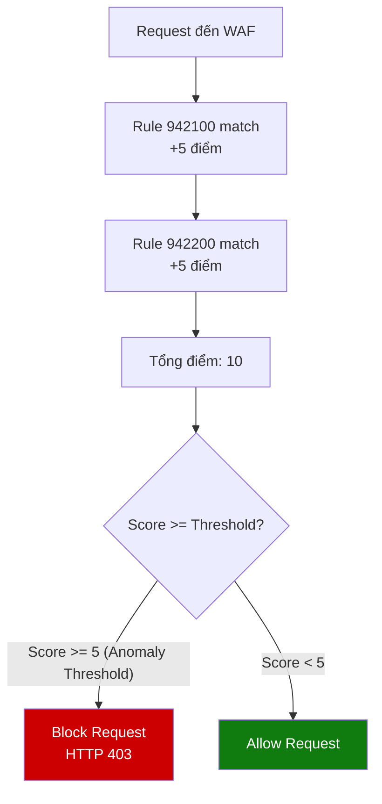
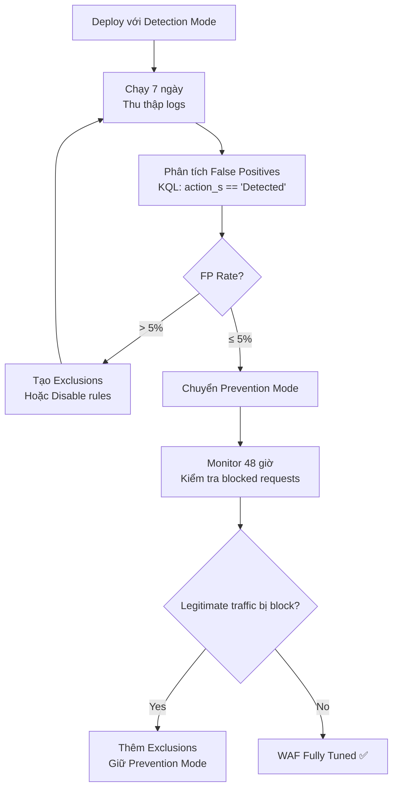

# 07 - Cấu hình WAF Chi tiết

## WAF Configuration Guide — Azure Application Gateway WAF v2

---

## 1. Tổng quan Kiến trúc WAF Policy



---

## 2. Detection Mode vs Prevention Mode

### So sánh

| Tiêu chí | Detection Mode | Prevention Mode |
|----------|---------------|----------------|
| **Hành động** | Log only, không chặn | Log + Chặn request |
| **HTTP Response** | Cho phép request qua | 403 Forbidden |
| **Mục đích** | Tuning, tìm false positive | Production protection |
| **False Positive** | Không ảnh hưởng traffic | Có thể block legitimate traffic |
| **Khuyến nghị** | Phase 1 — Tuning | Phase 2 — Production |

### Quy trình Chuyển Mode



### Chuyển sang Prevention Mode

```bash
# Azure CLI
az network application-gateway waf-policy policy-setting update \
  --policy-name waf-lab-policy \
  --resource-group waf-lab-rg \
  --mode Prevention \
  --state Enabled

# Kiểm tra
az network application-gateway waf-policy show \
  --resource-group waf-lab-rg \
  --name waf-lab-policy \
  --query "policySettings.mode" \
  --output tsv
# Expected: Prevention
```


---

## 3. OWASP Core Rule Set (CRS) 3.2 — Chi tiết

### 3.1 Cơ chế Anomaly Scoring

Azure WAF CRS 3.2 dùng **Anomaly Scoring** (không phải block ngay từng rule):



| Anomaly Score | Mức độ | Hành động |
|--------------|--------|-----------|
| 5 | Critical | Block |
| 4 | Error | Block (khi threshold = 4) |
| 3 | Warning | Log only |
| 2 | Notice | Log only |

### 3.2 Rule Groups Chi tiết

#### REQUEST-913: Scanner Detection

| Rule ID | Mô tả | Mức độ |
|---------|-------|--------|
| 913100 | Found User-Agent associated with security scanner | Critical (5) |
| 913101 | Found User-Agent associated with scripting/generic HTTP client | Notice (2) |
| 913102 | Found User-Agent associated with web crawler/bot | Notice (2) |
| 913110 | Found request header associated with security scanner | Warning (3) |
| 913120 | Found request filename/argument associated with security scanner | Warning (3) |

#### REQUEST-930: Local File Inclusion (LFI)

| Rule ID | Mô tả | Mức độ |
|---------|-------|--------|
| 930100 | Path Traversal Attack (/../) | Critical (5) |
| 930110 | Path Traversal Attack (/../) | Critical (5) |
| 930120 | OS File Access Attempt | Critical (5) |
| 930130 | Restricted File Access Attempt | Critical (5) |

#### REQUEST-941: Cross-Site Scripting (XSS)

| Rule ID | Mô tả | Mức độ |
|---------|-------|--------|
| 941100 | XSS Attack Detected via libinjection | Critical (5) |
| 941101 | XSS Attack Detected via libinjection | Critical (5) |
| 941110 | XSS Filter — Category 1: Script Tag Vector | Error (4) |
| 941120 | XSS Filter — Category 2: Event Handler Vector | Error (4) |
| 941130 | XSS Filter — Category 3: Attribute Vector | Error (4) |
| 941140 | XSS Filter — Category 4: JavaScript URI Vector | Error (4) |
| 941150 | XSS Filter — Category 5: Disallowed HTML Attributes | Warning (3) |
| 941160 | NoScript XSS InjectionChecker: HTML Injection | Error (4) |
| 941170 | NoScript XSS InjectionChecker: Attribute Injection | Warning (3) |
| 941180 | Node-Validator Blacklist Keywords | Warning (3) |
| 941190 | IE XSS Filters — Attack Detected | Warning (3) |
| 941200 | IE XSS Filters — Attack Detected | Warning (3) |
| 941210 | IE XSS Filters — Attack Detected | Warning (3) |

#### REQUEST-942: SQL Injection

| Rule ID | Mô tả | Mức độ |
|---------|-------|--------|
| 942100 | SQL Injection Attack Detected via libinjection | Critical (5) |
| 942110 | SQL Injection Attack: Common Injection Testing Detected | Warning (3) |
| 942120 | SQL Injection Attack: SQL Operator Detected | Warning (3) |
| 942130 | SQL Injection Attack: SQL Tautology Detected | Error (4) |
| 942140 | SQL Injection Attack: Common DB Names Detected | Warning (3) |
| 942150 | SQL Injection Attack | Warning (3) |
| 942160 | Detects blind sqli tests using sleep() or benchmark() | Warning (3) |
| 942170 | Detects SQL benchmark and sleep injection attempts | Error (4) |
| 942180 | Detects basic SQL authentication bypass attempts | Critical (5) |
| 942190 | Detects MSSQL code execution and information gathering | Critical (5) |
| 942200 | Detects MySQL comment-/space-obfuscated injections | Warning (3) |
| 942210 | Detects chained SQL injection attempts | Error (4) |
| 942220 | Looking for integer overflow attacks | Warning (3) |
| 942230 | Detects conditional SQL injection attempts | Warning (3) |
| 942240 | Detects MySQL charset switch and MSSQL DoS attempts | Warning (3) |
| 942250 | Detects MATCH AGAINST, MERGE and EXECUTE IMMEDIATE injections | Error (4) |
| 942260 | Detects basic SQL authentication bypass attempts (2/3) | Critical (5) |
| 942270 | Looking for basic sql injection (common attack string) | Critical (5) |
| 942280 | Detects Postgres pg_sleep injection, waitfor delay attacks | Critical (5) |
| 942290 | Finds basic MongoDB SQL injection attempts | Critical (5) |
| 942300 | Detects MySQL comments, conditions and ch(a)r injections | Warning (3) |


---

## 4. Custom Rules — Cấu hình Chi tiết

### 4.1 Block SQLMap User-Agent

```json
{
  "name": "BlockSQLMapUA",
  "priority": 10,
  "ruleType": "MatchRule",
  "action": "Block",
  "matchConditions": [
    {
      "matchVariables": [
        {
          "variableName": "RequestHeaders",
          "selector": "User-Agent"
        }
      ],
      "operator": "Contains",
      "negationCondition": false,
      "matchValues": ["sqlmap", "SQLMap"]
    }
  ]
}
```

### 4.2 Block Nikto Scanner

```json
{
  "name": "BlockNiktoUA",
  "priority": 11,
  "ruleType": "MatchRule",
  "action": "Block",
  "matchConditions": [
    {
      "matchVariables": [
        {
          "variableName": "RequestHeaders",
          "selector": "User-Agent"
        }
      ],
      "operator": "Contains",
      "negationCondition": false,
      "matchValues": ["Nikto", "nikto"]
    }
  ]
}
```

### 4.3 Rate Limiting Login Endpoint

```json
{
  "name": "RateLimitLogin",
  "priority": 20,
  "ruleType": "RateLimitRule",
  "action": "Block",
  "rateLimitDuration": "OneMin",
  "rateLimitThreshold": 10,
  "groupByUserSession": [
    {
      "groupByVariables": [
        {
          "variableName": "SocketAddr"
        }
      ]
    }
  ],
  "matchConditions": [
    {
      "matchVariables": [
        {
          "variableName": "RequestUri"
        }
      ],
      "operator": "Contains",
      "negationCondition": false,
      "matchValues": ["/rest/user/login"]
    }
  ]
}
```

### 4.4 Block Azure IMDS Access (SSRF Prevention)

```json
{
  "name": "BlockIMDS",
  "priority": 30,
  "ruleType": "MatchRule",
  "action": "Block",
  "matchConditions": [
    {
      "matchVariables": [
        {
          "variableName": "RequestBody"
        }
      ],
      "operator": "Contains",
      "negationCondition": false,
      "matchValues": ["169.254.169.254", "metadata.azure.com"]
    }
  ]
}
```

### 4.5 Thêm Custom Rules qua Azure CLI

```bash
# Block SQLMap
az network application-gateway waf-policy custom-rule create \
  --policy-name waf-lab-policy \
  --resource-group waf-lab-rg \
  --name BlockSQLMapUA \
  --priority 10 \
  --rule-type MatchRule \
  --action Block

az network application-gateway waf-policy custom-rule match-condition add \
  --policy-name waf-lab-policy \
  --resource-group waf-lab-rg \
  --rule-name BlockSQLMapUA \
  --match-variable RequestHeaders \
  --selector User-Agent \
  --operator Contains \
  --values "sqlmap"

# Block Nikto
az network application-gateway waf-policy custom-rule create \
  --policy-name waf-lab-policy \
  --resource-group waf-lab-rg \
  --name BlockNiktoUA \
  --priority 11 \
  --rule-type MatchRule \
  --action Block

az network application-gateway waf-policy custom-rule match-condition add \
  --policy-name waf-lab-policy \
  --resource-group waf-lab-rg \
  --rule-name BlockNiktoUA \
  --match-variable RequestHeaders \
  --selector User-Agent \
  --operator Contains \
  --values "Nikto"
```

---

## 5. WAF Exclusions — Xử lý False Positives

### 5.1 Khi nào cần Exclusion?

False positive xảy ra khi WAF block request hợp lệ. Ví dụ:
- Ứng dụng có chứa keyword giống SQL trong body (form data)
- REST API gửi JSON với ký tự đặc biệt
- Search functionality với ký tự `'` (apostrophe)

### 5.2 Tạo Exclusion

```bash
# Ví dụ: Bỏ qua kiểm tra header Authorization
az network application-gateway waf-policy managed-rule exclusion add \
  --policy-name waf-lab-policy \
  --resource-group waf-lab-rg \
  --match-variable "RequestHeaderNames" \
  --selector-match-operator "Equals" \
  --selector "Authorization"

# Bỏ qua rule 942100 cho specific parameter
az network application-gateway waf-policy managed-rule exclusion add \
  --policy-name waf-lab-policy \
  --resource-group waf-lab-rg \
  --match-variable "RequestArgNames" \
  --selector-match-operator "Equals" \
  --selector "search_query"
```

### 5.3 Exclusion Scope

| Exclusion Type | Phạm vi | Dùng khi |
|----------------|---------|----------|
| Per-rule exclusion | Chỉ bỏ qua rule cụ thể | False positive từ 1 rule |
| Per-ruleset exclusion | Bỏ qua toàn bộ rule group | Cả rule group gây vấn đề |
| Global exclusion | Bỏ qua variable cho mọi rule | Variable luôn gây FP |

---

## 6. WAF Logging Configuration

### 6.1 Log Categories

| Category | Mô tả | Bảng trong LAW |
|----------|-------|----------------|
| `ApplicationGatewayFirewallLog` | WAF block/detect events | `AzureDiagnostics` |
| `ApplicationGatewayAccessLog` | Tất cả requests (200, 403, v.v.) | `AzureDiagnostics` |
| `ApplicationGatewayPerformanceLog` | Hiệu năng AGW | `AzureDiagnostics` |

### 6.2 FirewallLog Schema

```json
{
  "timeStamp": "2024-01-15T10:30:00Z",
  "resourceId": "/subscriptions/.../waf-lab-agw",
  "operationName": "ApplicationGatewayFirewall",
  "category": "ApplicationGatewayFirewallLog",
  "properties": {
    "instanceId": "appgw_1",
    "clientIp": "103.x.x.x",
    "requestUri": "/rest/products/search?q=' OR 1=1--",
    "ruleSetType": "OWASP",
    "ruleSetVersion": "3.2",
    "ruleId": "942100",
    "ruleGroup": "REQUEST-942-APPLICATION-ATTACK-SQLI",
    "message": "SQL Injection Attack Detected via libinjection",
    "action": "Blocked",
    "site": "Global",
    "details": {
      "message": "Warning. Pattern match ...",
      "data": "Matched Data: ...",
      "file": "rules/REQUEST-942-APPLICATION-ATTACK-SQLI.conf",
      "line": "45"
    },
    "hostname": "40.x.x.x",
    "transactionId": "abc123def456"
  }
}
```

---

## 7. Best Practices

### 7.1 WAF Deployment Checklist

| # | Best Practice | Trạng thái |
|---|--------------|-----------|
| 1 | Dùng Prevention Mode trong production | ☐ |
| 2 | Bắt đầu với Detection Mode để tune | ☐ |
| 3 | Enable OWASP CRS 3.2 (không dùng 2.x) | ☐ |
| 4 | Enable Request Body Inspection | ☐ |
| 5 | Set Max Request Body Size phù hợp | ☐ |
| 6 | Custom Rules cho scanner detection | ☐ |
| 7 | Rate limiting cho authentication endpoints | ☐ |
| 8 | Diagnostic Settings gửi logs vào LAW | ☐ |
| 9 | Review False Positives hàng tuần | ☐ |
| 10 | Test WAF sau mỗi thay đổi rules | ☐ |

### 7.2 Anomaly Score Tuning



---

*Tài liệu tiếp theo: [08-monitoring-logging.md](08-monitoring-logging.md)*
