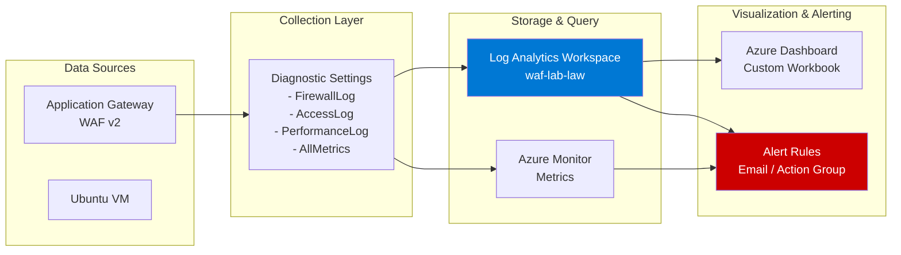
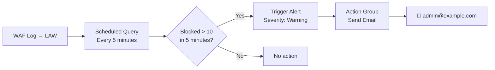
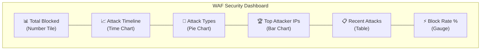

# 08 - Monitoring và Logging

## Azure Monitor + Log Analytics — WAF Observability

---

## 1. Kiến trúc Monitoring



---

## 2. Azure Monitor — Metrics

### 2.1 Key Metrics cho WAF

| Metric Name | Mô tả | Unit | Alert Threshold |
|-------------|-------|------|----------------|
| `TotalRequests` | Tổng requests qua AGW | Count | - |
| `BlockedRequests` | Requests bị WAF block | Count | > 10/5min |
| `BlockedReqRule` | Blocked theo rule ID | Count | - |
| `FailedRequests` | Requests thất bại | Count | > 50/5min |
| `HealthyHostCount` | Số backend healthy | Count | < 1 |
| `UnhealthyHostCount` | Số backend unhealthy | Count | > 0 |
| `Throughput` | Bandwidth qua AGW | Bytes/s | - |
| `ConnectionsPerSecond` | Kết nối mới/giây | Count | - |
| `CapacityUnits` | WAF capacity units dùng | Count | > 10 |

### 2.2 Xem Metrics trên Azure Portal

1. Azure Portal → `waf-lab-agw` → **Metrics**
2. Chọn Metric Namespace: `Application gateway standard metrics`
3. Thêm metric: `BlockedRequests`
4. Aggregation: `Sum`
5. Time range: `Last 1 hour`
6. Granularity: `1 minute`

### 2.3 Tạo Custom Metrics Dashboard

```bash
# Azure CLI — Tạo Alert Rule cho BlockedRequests
az monitor metrics alert create \
  --name "WAF-High-Block-Rate" \
  --resource-group waf-lab-rg \
  --scopes $(az network application-gateway show \
    --resource-group waf-lab-rg \
    --name waf-lab-agw --query id -o tsv) \
  --condition "avg BlockedRequests > 10" \
  --window-size 5m \
  --evaluation-frequency 1m \
  --severity 2 \
  --description "WAF blocking high number of requests"
```

---

## 3. Log Analytics — KQL Queries

### 3.1 Query 1: Tất cả WAF Blocked Events

```kusto
AzureDiagnostics
| where Category == "ApplicationGatewayFirewallLog"
| where action_s == "Blocked"
| project
    TimeGenerated,
    clientIp_s,
    requestUri_s,
    ruleSetVersion_s,
    ruleId_s,
    Message,
    action_s
| order by TimeGenerated desc
| take 100
```

**Kết quả mong đợi:**

| TimeGenerated | clientIp_s | requestUri_s | ruleId_s | action_s |
|---------------|-----------|--------------|----------|---------|
| 2024-01-15T10:30:00Z | 103.x.x.x | /rest/products/search?q='... | 942100 | Blocked |
| 2024-01-15T10:30:01Z | 103.x.x.x | /search?q=\<script\> | 941100 | Blocked |

### 3.2 Query 2: Thống kê theo Rule ID

```kusto
AzureDiagnostics
| where Category == "ApplicationGatewayFirewallLog"
| where action_s == "Blocked"
| summarize
    BlockCount = count(),
    UniqueIPs = dcount(clientIp_s)
    by ruleId_s, Message
| order by BlockCount desc
| take 20
```


### 3.3 Query 3: Top Attacker IPs

```kusto
AzureDiagnostics
| where Category == "ApplicationGatewayFirewallLog"
| where action_s == "Blocked"
| summarize
    AttackCount = count(),
    RulesTriggered = makeset(ruleId_s),
    LastSeen = max(TimeGenerated)
    by clientIp_s
| order by AttackCount desc
| take 10
```

### 3.4 Query 4: SQL Injection Attack Timeline

```kusto
AzureDiagnostics
| where Category == "ApplicationGatewayFirewallLog"
| where ruleId_s startswith "942"
| summarize SQLiCount = count() by bin(TimeGenerated, 5m)
| render timechart
    with (title="SQL Injection Attempts - Timeline")
```

### 3.5 Query 5: XSS Attack Detection

```kusto
AzureDiagnostics
| where Category == "ApplicationGatewayFirewallLog"
| where ruleId_s startswith "941"
| project
    TimeGenerated,
    clientIp_s,
    requestUri_s,
    ruleId_s,
    Message
| order by TimeGenerated desc
```

### 3.6 Query 6: Path Traversal Detection

```kusto
AzureDiagnostics
| where Category == "ApplicationGatewayFirewallLog"
| where ruleId_s startswith "930"
| project
    TimeGenerated,
    clientIp_s,
    requestUri_s,
    ruleId_s,
    action_s
| order by TimeGenerated desc
```

### 3.7 Query 7: Access Log — Response Code Distribution

```kusto
AzureDiagnostics
| where Category == "ApplicationGatewayAccessLog"
| summarize
    RequestCount = count()
    by httpStatus_d
| order by RequestCount desc
| render piechart
    with (title="HTTP Response Code Distribution")
```

### 3.8 Query 8: WAF Block Rate theo giờ

```kusto
let TotalReq = AzureDiagnostics
    | where Category == "ApplicationGatewayAccessLog"
    | summarize Total = count() by bin(TimeGenerated, 1h);
let BlockedReq = AzureDiagnostics
    | where Category == "ApplicationGatewayFirewallLog"
    | where action_s == "Blocked"
    | summarize Blocked = count() by bin(TimeGenerated, 1h);
TotalReq
| join kind=leftouter BlockedReq on TimeGenerated
| extend BlockRate = round(100.0 * Blocked / Total, 2)
| project TimeGenerated, Total, Blocked, BlockRate
| render columnchart
    with (title="WAF Block Rate % per Hour")
```

### 3.9 Query 9: Custom Rule Triggers

```kusto
AzureDiagnostics
| where Category == "ApplicationGatewayFirewallLog"
| where ruleSetType_s == "Custom"
| summarize
    TriggerCount = count()
    by ruleName_s, clientIp_s, bin(TimeGenerated, 1h)
| order by TriggerCount desc
```

### 3.10 Query 10: Attack Summary Dashboard

```kusto
AzureDiagnostics
| where Category == "ApplicationGatewayFirewallLog"
| where action_s == "Blocked"
| extend AttackType = case(
    ruleId_s startswith "942", "SQL Injection",
    ruleId_s startswith "941", "XSS",
    ruleId_s startswith "930", "Path Traversal",
    ruleId_s startswith "932", "Command Injection",
    ruleId_s startswith "913", "Scanner Detection",
    "Other"
)
| summarize Count = count() by AttackType
| order by Count desc
| render barchart
    with (title="Attack Types Blocked by WAF")
```

---

## 4. Diagnostic Settings — Cấu hình Chi tiết

### 4.1 Kiểm tra Diagnostic Settings

```bash
# Lấy AGW Resource ID
AGW_ID=$(az network application-gateway show \
  --resource-group waf-lab-rg \
  --name waf-lab-agw \
  --query id --output tsv)

# Kiểm tra Diagnostic Settings
az monitor diagnostic-settings list \
  --resource $AGW_ID \
  --output table
```

### 4.2 Xác nhận Logs đang chảy vào LAW

Sau 5-10 phút từ khi cấu hình, chạy query kiểm tra:

```kusto
// Kiểm tra logs có vào LAW không
AzureDiagnostics
| where ResourceType == "APPLICATIONGATEWAYS"
| summarize LastLog = max(TimeGenerated), Count = count()
by Category
```

Kết quả mong đợi:

| Category | Count | LastLog |
|----------|-------|---------|
| ApplicationGatewayFirewallLog | 150 | 2024-01-15T10:35:00Z |
| ApplicationGatewayAccessLog | 1250 | 2024-01-15T10:35:00Z |
| ApplicationGatewayPerformanceLog | 30 | 2024-01-15T10:35:00Z |

---

## 5. Azure Monitor Alerts

### 5.1 Alert Rule — High Block Rate



### 5.2 Tạo Action Group

```bash
# Tạo Action Group
az monitor action-group create \
  --resource-group waf-lab-rg \
  --name waf-alert-group \
  --short-name wafAlert \
  --action email admin admin@student.edu.vn
```

### 5.3 Tạo Alert Rule từ LAW Query

```bash
# Lấy LAW Resource ID
LAW_ID=$(az monitor log-analytics workspace show \
  --resource-group waf-lab-rg \
  --workspace-name waf-lab-law \
  --query id --output tsv)

# Tạo Scheduled Query Alert
az monitor scheduled-query create \
  --resource-group waf-lab-rg \
  --name "WAF-Attack-Alert" \
  --scopes $LAW_ID \
  --condition-query "AzureDiagnostics | where Category == 'ApplicationGatewayFirewallLog' | where action_s == 'Blocked' | summarize Count = count()" \
  --condition-threshold 10 \
  --condition-operator GreaterThan \
  --condition-time-aggregation Count \
  --evaluation-frequency 5m \
  --window-size 5m \
  --severity 2 \
  --action-groups $(az monitor action-group show \
    --resource-group waf-lab-rg \
    --name waf-alert-group \
    --query id -o tsv) \
  --description "Alert when WAF blocks more than 10 requests in 5 minutes"
```

---

## 6. Azure Workbook — Custom Dashboard

### 6.1 Tạo Workbook

1. Azure Portal → **Monitor** → **Workbooks** → **New**
2. Thêm các tiles:

### Tile 1: Total Blocked Requests (KQL)

```kusto
AzureDiagnostics
| where Category == "ApplicationGatewayFirewallLog"
| where action_s == "Blocked"
| summarize BlockedTotal = count()
```

### Tile 2: Attack Timeline Chart

```kusto
AzureDiagnostics
| where Category == "ApplicationGatewayFirewallLog"
| where action_s == "Blocked"
| extend AttackType = case(
    ruleId_s startswith "942", "SQLi",
    ruleId_s startswith "941", "XSS",
    ruleId_s startswith "930", "PathTraversal",
    ruleId_s startswith "913", "Scanner",
    "Other"
)
| summarize Count = count() by AttackType, bin(TimeGenerated, 30m)
| render timechart
```

### Tile 3: Top 10 Source IPs

```kusto
AzureDiagnostics
| where Category == "ApplicationGatewayFirewallLog"
| where action_s == "Blocked"
| summarize AttackCount = count() by clientIp_s
| top 10 by AttackCount
| render barchart
```

### 6.2 Dashboard Layout



---

## 7. Log Retention và Export

### 7.1 Cấu hình Retention

```bash
# Set retention 90 ngày (mặc định 30)
az monitor log-analytics workspace update \
  --resource-group waf-lab-rg \
  --workspace-name waf-lab-law \
  --retention-time 90
```

### 7.2 Export Logs cho Báo cáo

```bash
# Export WAF logs ra CSV (qua Azure CLI + KQL)
az monitor log-analytics query \
  --workspace $(az monitor log-analytics workspace show \
    --resource-group waf-lab-rg \
    --workspace-name waf-lab-law \
    --query customerId -o tsv) \
  --analytics-query "AzureDiagnostics | where Category == 'ApplicationGatewayFirewallLog' | where action_s == 'Blocked' | project TimeGenerated, clientIp_s, requestUri_s, ruleId_s, action_s | order by TimeGenerated desc | take 1000" \
  --output table > waf-blocked-events.txt
```

---

*Tài liệu tiếp theo: [09-test-plan.md](09-test-plan.md)*
