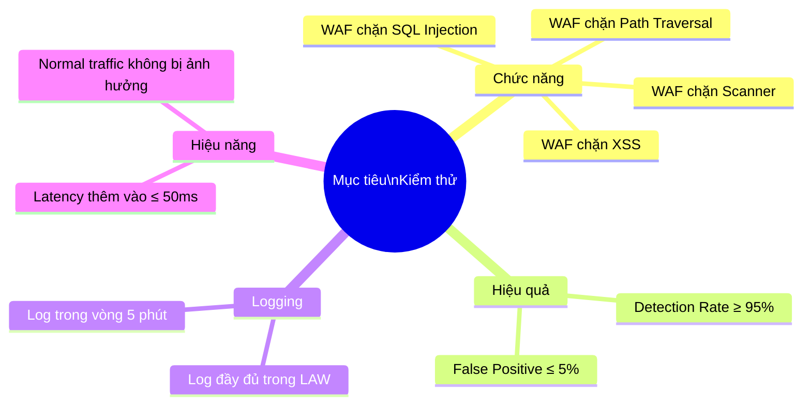
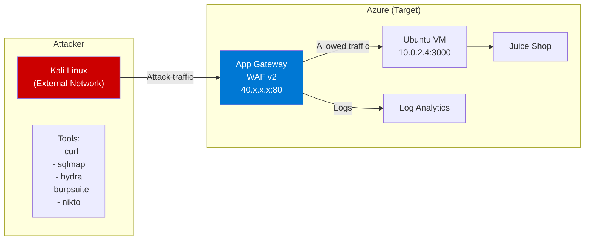
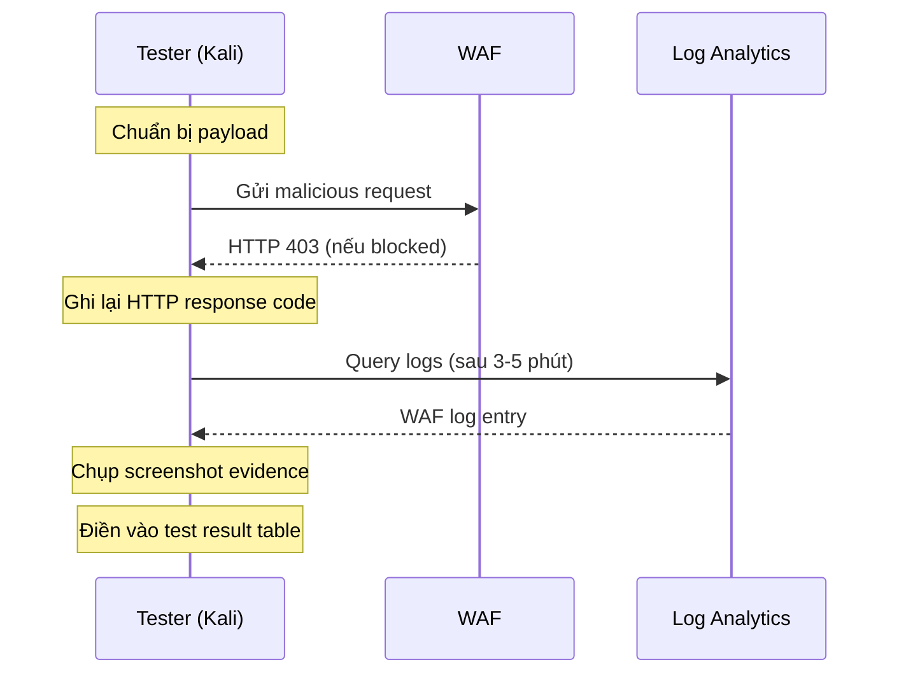

# 09 - Kế hoạch Kiểm thử

## Test Plan — WAF Security Testing

---

## 1. Mục tiêu Kiểm thử



---

## 2. Môi trường Kiểm thử

### 2.1 Topology



### 2.2 Thông tin Môi trường

| Thành phần | Giá trị |
|-----------|---------|
| **Target URL** | `http://<AGW_PUBLIC_IP>/` |
| **Attacker OS** | Kali Linux 2023.x |
| **WAF Mode** | Prevention |
| **OWASP CRS** | 3.2 |
| **Test Date** | [Điền ngày kiểm thử] |
| **Tester** | [Tên sinh viên] |

### 2.3 Pre-Test Checklist

| # | Kiểm tra | OK? |
|---|---------|-----|
| 1 | Juice Shop accessible qua AGW IP | ☐ |
| 2 | WAF Policy ở Prevention Mode | ☐ |
| 3 | Log Analytics nhận logs | ☐ |
| 4 | Kali Linux có internet access đến AGW | ☐ |
| 5 | sqlmap, hydra, nikto đã cài | ☐ |
| 6 | Burp Suite Community đã cài và cấu hình proxy | ☐ |

---

## 3. Test Cases Summary

| TC ID | Tên Test | File | Tool | Priority |
|-------|---------|------|------|---------|
| TC-SQL-01 | Basic SQLi — OR bypass | 10-sql-injection-test.md | curl | Critical |
| TC-SQL-02 | UNION SELECT SQLi | 10-sql-injection-test.md | curl | Critical |
| TC-SQL-03 | Blind SQLi — sleep() | 10-sql-injection-test.md | curl | High |
| TC-SQL-04 | SQLi in POST body | 10-sql-injection-test.md | curl | Critical |
| TC-SQL-05 | SQLi URL encoded | 10-sql-injection-test.md | curl | High |
| TC-XSS-01 | Reflected XSS — script tag | 11-xss-test.md | curl | Critical |
| TC-XSS-02 | XSS — img onerror | 11-xss-test.md | curl | Critical |
| TC-XSS-03 | XSS — event handler | 11-xss-test.md | curl | High |
| TC-XSS-04 | XSS — JavaScript URI | 11-xss-test.md | curl | High |
| TC-PATH-01 | Basic path traversal | 12-path-traversal-test.md | curl | Critical |
| TC-PATH-02 | URL encoded traversal | 12-path-traversal-test.md | curl | High |
| TC-PATH-03 | Double encoded traversal | 12-path-traversal-test.md | curl | High |
| TC-SQLMAP-01 | SQLMap automated scan | 13-sqlmap-test.md | sqlmap | Critical |
| TC-SQLMAP-02 | SQLMap với WAF bypass flags | 13-sqlmap-test.md | sqlmap | High |
| TC-BF-01 | Brute force login — hydra | 14-brute-force-test.md | hydra | High |
| TC-BF-02 | Rate limit verification | 14-brute-force-test.md | curl | High |
| TC-NORMAL-01 | Normal browsing traffic | 09-test-plan.md | curl/browser | Critical |
| TC-NORMAL-02 | False positive check | 09-test-plan.md | curl | Critical |

---

## 4. Evidence Requirements

Mỗi test case cần thu thập:

### 4.1 Evidence Loại A — HTTP Response

```bash
# Capture full HTTP response
curl -v -s -o /dev/null "http://<AGW_IP>/..." 2>&1 | \
  tee test_evidence_TC-SQL-01.txt
```

Nội dung cần capture:
- HTTP Status Code (403 hoặc 200)
- Response headers
- Response body (WAF block message)

### 4.2 Evidence Loại B — WAF Log

```kusto
// Query để lấy WAF log cho test case cụ thể
AzureDiagnostics
| where Category == "ApplicationGatewayFirewallLog"
| where clientIp_s == "<KALI_IP>"
| where TimeGenerated > ago(10m)
| project TimeGenerated, clientIp_s, requestUri_s, ruleId_s, Message, action_s
| order by TimeGenerated desc
```

Export kết quả → Screenshot → Đưa vào báo cáo.

### 4.3 Evidence Loại C — Screenshot

Chụp màn hình:
1. Browser showing 403 Forbidden page
2. Kali Linux terminal với curl output
3. Log Analytics query results
4. Azure Portal — WAF Metrics

---

## 5. Test Execution Flow



---

## 6. Test Results Template

### 6.1 Bảng Kết quả (điền sau khi test)

| TC ID | Payload | Expected | Actual | Status | Evidence |
|-------|---------|----------|--------|--------|---------|
| TC-SQL-01 | `' OR 1=1--` | 403 Block | | ⬜ | |
| TC-SQL-02 | `UNION SELECT` | 403 Block | | ⬜ | |
| TC-SQL-03 | `SLEEP(5)` | 403 Block | | ⬜ | |
| TC-SQL-04 | POST body SQLi | 403 Block | | ⬜ | |
| TC-SQL-05 | URL encoded SQLi | 403 Block | | ⬜ | |
| TC-XSS-01 | `<script>alert(1)</script>` | 403 Block | | ⬜ | |
| TC-XSS-02 | `` | 403 Block | | ⬜ | |
| TC-XSS-03 | `onmouseover=alert(1)` | 403 Block | | ⬜ | |
| TC-XSS-04 | `javascript:alert(1)` | 403 Block | | ⬜ | |
| TC-PATH-01 | `../../../../etc/passwd` | 403 Block | | ⬜ | |
| TC-PATH-02 | URL encoded traversal | 403 Block | | ⬜ | |
| TC-PATH-03 | Double encoded traversal | 403 Block | | ⬜ | |
| TC-SQLMAP-01 | sqlmap auto scan | All blocked | | ⬜ | |
| TC-BF-01 | Hydra brute force | Rate limited | | ⬜ | |
| TC-NORMAL-01 | Normal GET / | 200 OK | | ⬜ | |

**Ghi chú Status**: ✅ Pass | ❌ Fail | ⚠️ Partial

---

## 7. Pass/Fail Criteria

| Tiêu chí | Pass | Fail |
|---------|------|------|
| SQL Injection block rate | 100% (5/5 cases) | < 100% |
| XSS block rate | 100% (4/4 cases) | < 100% |
| Path Traversal block rate | 100% (3/3 cases) | < 100% |
| SQLMap blocked | Scan terminates with 0 results | SQLMap extracts data |
| Rate limiting | Brute force rate limited after 10 req/min | No rate limiting |
| Normal traffic | 200 OK, no false positives | False positives > 5% |
| Log availability | Logs in LAW within 5 min | Logs missing or delayed > 15 min |

---

*Tài liệu tiếp theo: [10-sql-injection-test.md](10-sql-injection-test.md)*
