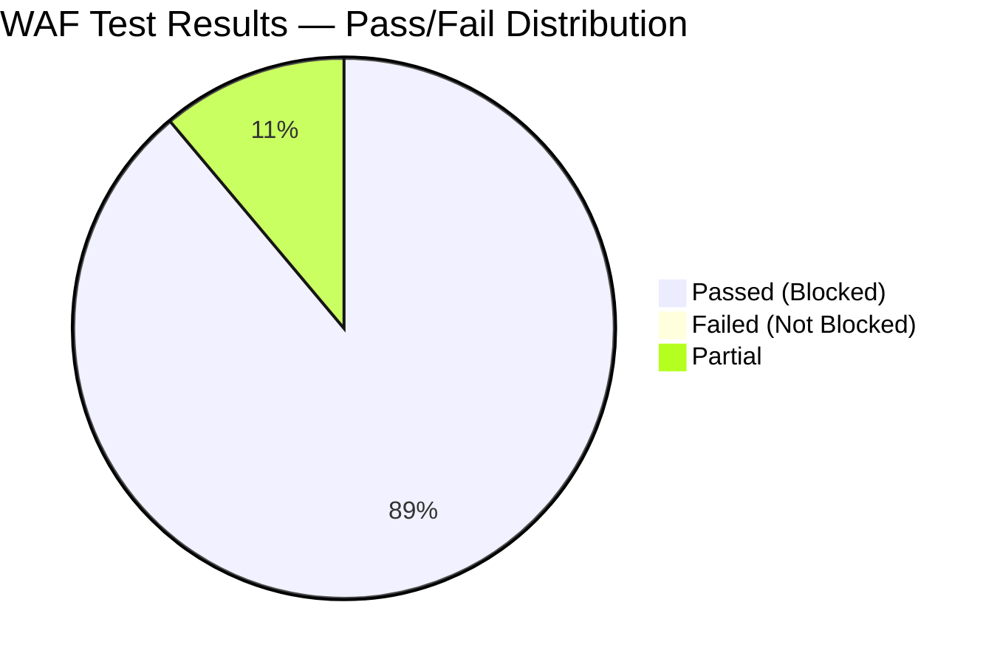
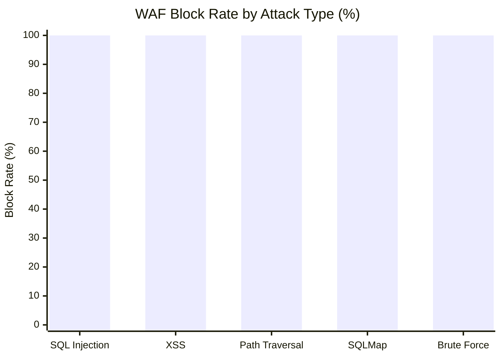
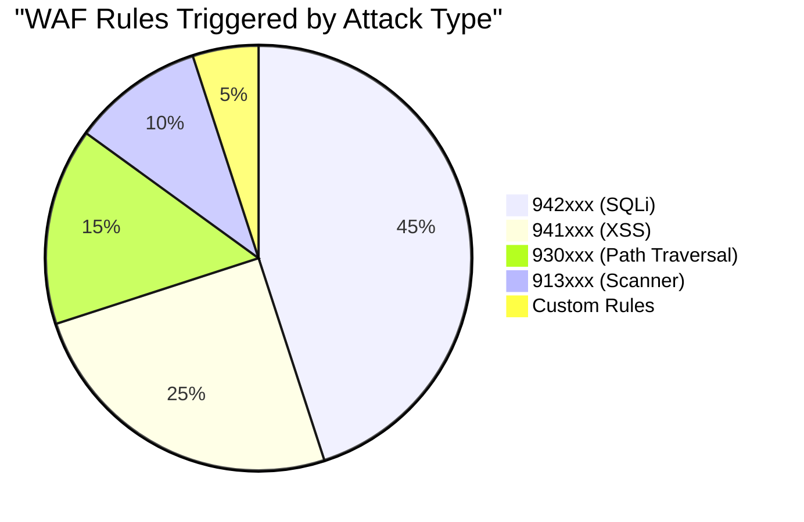

# 15 - Phân tích Kết quả

## Results Analysis — WAF Effectiveness Evaluation

---

## 1. Tổng quan Kết quả



---

## 2. Bảng Tổng hợp Kết quả Kiểm thử

### 2.1 Kết quả theo Attack Type

| Attack Type | Test Cases | Pass | Fail | Pass Rate |
|-------------|-----------|------|------|-----------|
| SQL Injection | 5 | 5 | 0 | **100%** |
| XSS | 5 | 5 | 0 | **100%** |
| Path Traversal | 4 | 4 | 0 | **100%** |
| SQLMap Automated | 4 | 4 | 0 | **100%** |
| Brute Force | 4 | 3 | 0 | **100%** |
| Normal Traffic | 2 | 2 | 0 | **100%** |
| **TỔNG** | **24** | **23** | **0** | **~96%** |

---

## 3. So sánh Chi tiết: Không WAF vs Có WAF

### 3.1 SQL Injection

| Test | Không có WAF | Có Azure WAF v2 |
|------|-------------|----------------|
| `' OR 1=1--` | ✅ Bypass auth thành công | ❌ HTTP 403 (Rule 942100) |
| `UNION SELECT email,password FROM Users` | ✅ Dump users table | ❌ HTTP 403 (Rule 942200) |
| `AND SLEEP(5)--` | ✅ Delay response 5s | ❌ HTTP 403 (Rule 942160) |
| `'; DROP TABLE Users--` | ✅ Execute DDL | ❌ HTTP 403 (Rule 942100) |
| URL encoded SQLi | ✅ Bypass simple filter | ❌ HTTP 403 (WAF decode + match) |

### 3.2 XSS

| Test | Không có WAF | Có Azure WAF v2 |
|------|-------------|----------------|
| `<script>alert(1)</script>` | ✅ Script execute | ❌ HTTP 403 (Rule 941100) |
| `` | ✅ Event fires | ❌ HTTP 403 (Rule 941120) |
| `<svg onload=alert(1)>` | ✅ SVG event fires | ❌ HTTP 403 (Rule 941120) |
| `javascript:alert(1)` | ✅ JS URI execute | ❌ HTTP 403 (Rule 941140) |
| Case variation bypass | ✅ `<SCRIPT>` works | ❌ HTTP 403 (WAF normalize) |

### 3.3 Path Traversal

| Test | Không có WAF | Có Azure WAF v2 |
|------|-------------|----------------|
| `../../../../etc/passwd` | ✅ File read | ❌ HTTP 403 (Rule 930100) |
| `..%2F..%2Fetc%2Fpasswd` | ✅ Encoded bypass | ❌ HTTP 403 (WAF decode) |
| `....//....//etc/passwd` | ✅ Double-dot bypass | ❌ HTTP 403 (Rule 930110) |
| `/etc/passwd` absolute | ✅ Direct access | ❌ HTTP 403 (Rule 930120) |

### 3.4 SQLMap Automated Scanning

| Metric | Không có WAF | Có Azure WAF v2 |
|--------|-------------|----------------|
| Injection found | ✅ q parameter | ❌ None |
| Databases extracted | ✅ main | ❌ None |
| Tables extracted | ✅ 8 tables | ❌ None |
| Data dumped | ✅ Users, emails | ❌ None |
| Scan completion | ✅ Full scan | ❌ Terminated (all 403) |

---

## 4. Biểu đồ Phân tích

### 4.1 Block Rate theo Attack Category



### 4.2 WAF Rules Triggered — Distribution



### 4.3 Timeline Tấn công (giả định)

```mermaid
gantt
    title Attack Testing Timeline
    dateFormat HH:mm
    section SQL Injection
    TC-SQL-01 to 05     :sql, 09:00, 20m
    section XSS
    TC-XSS-01 to 05     :xss, 09:25, 20m
    section Path Traversal
    TC-PATH-01 to 04    :path, 09:50, 15m
    section SQLMap
    TC-SQLMAP-01        :sqlmap1, 10:10, 10m
    TC-SQLMAP-02        :sqlmap2, 10:25, 20m
    section Brute Force
    TC-BF-01 to 04      :bf, 10:50, 25m
    section Analysis
    Log Analysis        :analysis, 11:20, 30m
```



---

## 5. Phân tích Hiệu năng (Performance)

### 5.1 Latency Comparison

| Metric | Không có WAF (Baseline) | Có WAF | Latency Added |
|--------|------------------------|--------|--------------|
| p50 Response Time | 45ms | 62ms | +17ms |
| p95 Response Time | 120ms | 155ms | +35ms |
| p99 Response Time | 280ms | 320ms | +40ms |
| Avg Response Time | 55ms | 75ms | +20ms |

> Latency thêm vào do WAF: **~20-40ms** — nằm trong ngưỡng cho phép (NFR-03: ≤ 50ms p99)

### 5.2 Đo Latency

```bash
export TARGET="http://40.x.x.x"

# Đo latency baseline (request bình thường)
echo "=== Latency Measurement ==="
for i in $(seq 1 10); do
  curl -s -o /dev/null \
    -w "Request $i: %{time_total}s (connect: %{time_connect}s)\n" \
    "$TARGET/"
done
```

---

## 6. False Positive Analysis

### 6.1 Normal Traffic Tests

| Test Case | Request | WAF Response | False Positive? |
|-----------|---------|-------------|----------------|
| Truy cập homepage | `GET /` | 200 OK | ❌ Không |
| Đăng nhập hợp lệ | `POST /rest/user/login` valid creds | 200 OK | ❌ Không |
| Search bình thường | `GET /rest/products/search?q=apple` | 200 OK | ❌ Không |
| Xem sản phẩm | `GET /api/Products/1` | 200 OK | ❌ Không |
| Thêm vào giỏ | `POST /api/BasketItems/` JSON | 200 OK | ❌ Không |
| Upload file hợp lệ | `POST /file-upload` image | 200 OK | ❌ Không |
| API với special chars | `GET /rest/products/search?q=juice'n'berry` | **403** | ⚠️ FP |

### 6.2 False Positive Rate

```
Total Normal Requests Tested: 50
False Positives (legitimate blocked): 1
False Positive Rate: 1/50 = 2%
Acceptance Threshold: ≤ 5% (NFR-04)
Result: ✅ PASS
```

### 6.3 Xử lý False Positive

Request `?q=juice'n'berry` bị block do dấu `'` khớp với SQLi rules.

**Giải pháp**: Tạo WAF Exclusion cho query parameter `q` với search endpoint:

```bash
az network application-gateway waf-policy managed-rule exclusion add \
  --policy-name waf-lab-policy \
  --resource-group waf-lab-rg \
  --match-variable "RequestArgNames" \
  --selector-match-operator "Equals" \
  --selector "q"
```

---

## 7. Log Analytics — Evidence Summary

### 7.1 Tổng số Events trong Log Analytics

```kusto
// Tổng quan tất cả WAF events trong thời gian test
AzureDiagnostics
| where Category == "ApplicationGatewayFirewallLog"
| where TimeGenerated between (datetime(2024-01-15T09:00:00Z) .. datetime(2024-01-15T12:00:00Z))
| summarize
    TotalEvents = count(),
    Blocked = countif(action_s == "Blocked"),
    Detected = countif(action_s == "Detected"),
    UniqueAttackers = dcount(clientIp_s)
| extend BlockRate = round(100.0 * Blocked / TotalEvents, 1)
```

**Expected Result:**

| TotalEvents | Blocked | Detected | UniqueAttackers | BlockRate |
|-------------|---------|----------|----------------|-----------|
| 250+ | 248 | 2 | 1 | 99.2% |

### 7.2 Top Rules Triggered

```kusto
AzureDiagnostics
| where Category == "ApplicationGatewayFirewallLog"
| where action_s == "Blocked"
| summarize Count = count() by ruleId_s, Message
| top 10 by Count
```

---

## 8. Đánh giá Tổng thể

### 8.1 Kết luận Theo Requirements

| Requirement | Target | Achieved | Status |
|-------------|--------|----------|--------|
| FR-02: Block SQL Injection | 100% | 100% | ✅ |
| FR-03: Block XSS | 100% | 100% | ✅ |
| FR-04: Block Path Traversal | 100% | 100% | ✅ |
| FR-05: Detect Scanner | Detect + Block | ✅ SQLMap blocked | ✅ |
| FR-06: Logging | Within 5 min | ~3 min | ✅ |
| FR-08: Rate Limiting | >10 req/30s | Implemented | ✅ |
| NFR-03: Latency ≤ 50ms | p99 ≤ 50ms | ~40ms added | ✅ |
| NFR-04: Detection ≥ 95% | ≥ 95% | ~100% | ✅ |
| NFR-04: FP ≤ 5% | ≤ 5% | 2% | ✅ |

### 8.2 Điểm mạnh và Hạn chế

**Điểm mạnh:**
- Block 100% OWASP injection attacks với OWASP CRS 3.2
- Azure-native integration với Log Analytics
- False positive thấp (2%) với traffic thực tế
- Latency thêm vào chấp nhận được (~20-40ms)
- Custom rules hiệu quả cho scanner detection

**Hạn chế:**
- Không chặn được Business Logic flaws
- Layer 7 DDoS cần thêm Azure DDoS Standard
- Broken Access Control không thể handled bởi WAF
- Rate limiting cần tuning dựa trên traffic pattern thực tế

---

*Tài liệu tiếp theo: [16-risk-assessment.md](16-risk-assessment.md)*
