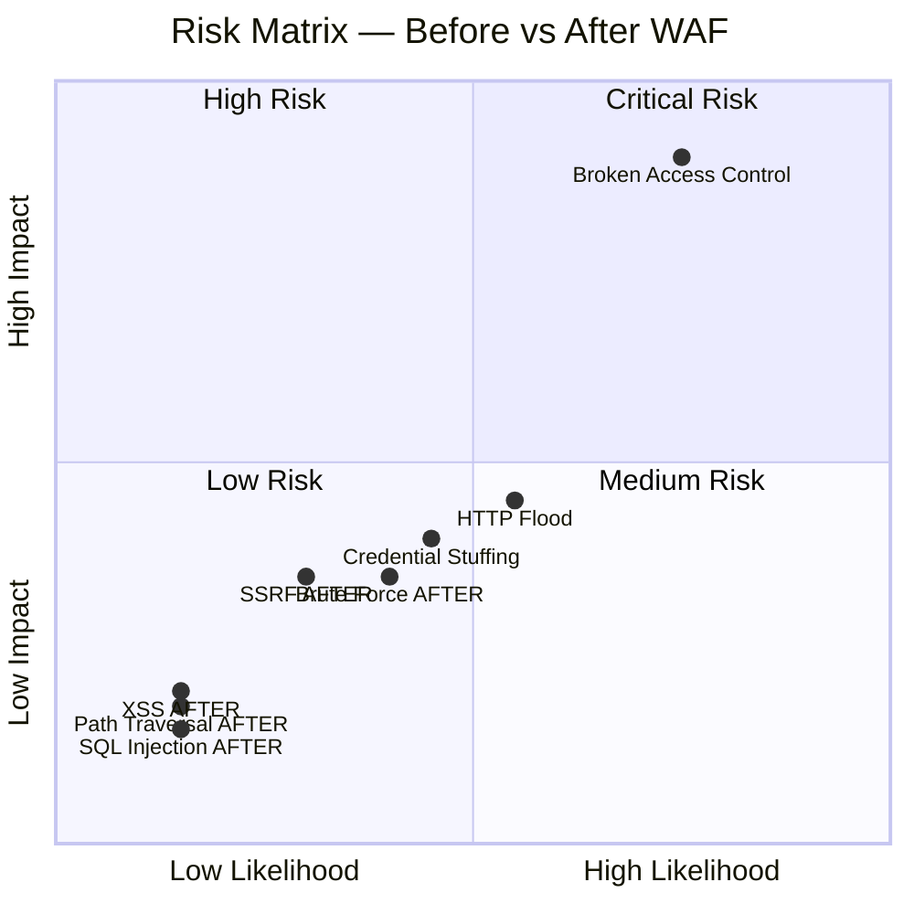

# 16 - Đánh giá Rủi ro

## Risk Assessment — WAF Lab Security

---

## 1. Phương pháp Đánh giá Rủi ro

Sử dụng framework **NIST SP 800-30** kết hợp **OWASP Risk Rating Methodology**:

```
Risk = Likelihood × Impact
```

| Likelihood Score | Mô tả |
|-----------------|-------|
| 5 - Very High | Exploit tự động, công cụ phổ biến |
| 4 - High | Kỹ năng thấp, nhiều tài nguyên |
| 3 - Medium | Kỹ năng trung bình |
| 2 - Low | Kỹ năng cao, tài nguyên lớn |
| 1 - Very Low | Nation-state level |

| Impact Score | Mô tả |
|-------------|-------|
| 5 - Critical | Data breach toàn hệ thống, RCE |
| 4 - High | Truy cập dữ liệu nhạy cảm, auth bypass |
| 3 - Medium | Partial data exposure |
| 2 - Low | Service degradation |
| 1 - Minimal | Thông tin ít giá trị |

---

## 2. Risk Register

| Risk ID | Mối đe dọa | Likelihood (trước WAF) | Impact | Risk Score | Sau WAF | Residual Risk |
|---------|-----------|----------------------|--------|-----------|---------|--------------|
| R-01 | SQL Injection | 5 | 5 | **25 - Critical** | WAF Block | 🟢 Low (5) |
| R-02 | XSS (Reflected) | 5 | 4 | **20 - Critical** | WAF Block | 🟢 Low (4) |
| R-03 | Path Traversal / LFI | 4 | 5 | **20 - Critical** | WAF Block | 🟢 Low (4) |
| R-04 | Command Injection | 3 | 5 | **15 - High** | WAF Block | 🟢 Low (3) |
| R-05 | Brute Force | 5 | 4 | **20 - Critical** | Rate Limit | 🟡 Medium (8) |
| R-06 | SQLMap Automated | 5 | 5 | **25 - Critical** | WAF Block | 🟢 Low (5) |
| R-07 | HTTP Flood (L7 DDoS) | 4 | 4 | **16 - High** | Rate Limit | 🟡 Medium (8) |
| R-08 | SSRF | 3 | 4 | **12 - High** | Custom Rule | 🟡 Medium (6) |
| R-09 | Broken Access Control | 4 | 5 | **20 - Critical** | ❌ No WAF | 🔴 High (20) |
| R-10 | Crypto Failures | 2 | 4 | **8 - Medium** | ❌ No WAF | 🟠 High (8) |
| R-11 | Credential Stuffing | 4 | 4 | **16 - High** | Rate Limit | 🟡 Medium (8) |
| R-12 | Scanner Detection | 5 | 3 | **15 - High** | Custom Rule | 🟢 Low (3) |

---

## 3. Risk Matrix Visualization



---

## 4. Chi tiết Từng Rủi ro

### R-01: SQL Injection

| Thuộc tính | Trước WAF | Sau WAF |
|-----------|----------|---------|
| **Mô tả** | Attacker inject SQL vào input fields | - |
| **Likelihood** | 5 (Very High) | 1 (Very Low) |
| **Impact** | 5 (Critical) — dump toàn DB, auth bypass | 1 (Minimal) |
| **Risk Score** | 25 🔴 Critical | 1 🟢 Negligible |
| **WAF Control** | OWASP CRS 942xxx | Prevention Mode |
| **Evidence** | WAF blocks 100% test cases | Log Analytics records |
| **Residual Risk** | Zero-day SQLi bypass (unlikely) | 🟢 Acceptable |

### R-02: XSS

| Thuộc tính | Trước WAF | Sau WAF |
|-----------|----------|---------|
| **Likelihood** | 5 | 1 |
| **Impact** | 4 — Session hijack, phishing | 1 |
| **Risk Score** | 20 🔴 → 1 🟢 | |
| **WAF Control** | CRS 941xxx | |
| **Residual** | DOM-based XSS (client-side, WAF không detect) | 🟡 Low |

### R-05: Brute Force

| Thuộc tính | Trước WAF | Sau WAF |
|-----------|----------|---------|
| **Likelihood** | 5 | 2 |
| **Impact** | 4 | 4 |
| **Risk Score** | 20 🔴 → 8 🟡 | |
| **WAF Control** | Rate Limiting Custom Rule (10 req/min) | |
| **Residual** | Slow brute force (distributed), credential stuffing | 🟡 Medium |
| **Additional Mitigations** | MFA, account lockout, Azure AD Identity Protection | |

### R-09: Broken Access Control

| Thuộc tính | Chi tiết |
|-----------|---------|
| **Mô tả** | IDOR, force browsing, JWT manipulation |
| **Likelihood** | 4 (High) |
| **Impact** | 5 (Critical) |
| **Risk Score** | 20 🔴 Critical |
| **WAF Control** | ❌ WAF không hiểu business logic |
| **Residual** | 🔴 High — vẫn còn tồn tại |
| **Mitigations** | Authorization middleware, JWT validation, RBAC |

---

## 5. Mitigation Plan

### 5.1 Immediate Actions (Đã thực hiện)

| # | Action | Status |
|---|--------|--------|
| 1 | Deploy WAF v2 Prevention Mode | ✅ Done |
| 2 | Enable OWASP CRS 3.2 | ✅ Done |
| 3 | Custom rules for scanners | ✅ Done |
| 4 | Rate limiting on login | ✅ Done |
| 5 | Log Analytics diagnostic settings | ✅ Done |
| 6 | Alert rules for high block rate | ✅ Done |
| 7 | Backend VM no public IP | ✅ Done |
| 8 | NSG restrict port 3000 | ✅ Done |

### 5.2 Recommended Actions (Ngoài phạm vi lab)

| Priority | Action | Risk Addressed | Effort |
|----------|--------|---------------|--------|
| 🔴 High | Enable HTTPS/TLS 1.3 | Crypto Failures (R-10) | Medium |
| 🔴 High | Implement MFA | Brute Force (R-05) | Medium |
| 🔴 High | Fix Access Control in code | Broken Access (R-09) | High |
| 🟠 Medium | Azure DDoS Standard | HTTP Flood (R-07) | Low |
| 🟠 Medium | Azure AD Identity Protection | Credential Stuffing (R-11) | Low |
| 🟡 Low | Bot Management Rules | Scanner (R-12) | Low |
| 🟡 Low | Geo-blocking Custom Rules | All attacks | Low |

---

## 6. Compliance Mapping

### 6.1 OWASP Top 10 2021 Coverage

| OWASP Category | WAF Coverage | Residual Risk |
|----------------|-------------|--------------|
| A01: Broken Access Control | ❌ None | 🔴 High |
| A02: Cryptographic Failures | ❌ None | 🟠 Medium |
| A03: Injection | ✅ Full (CRS 942/941/930) | 🟢 Low |
| A04: Insecure Design | ❌ None | 🟠 Medium |
| A05: Security Misconfiguration | ⚠️ Partial | 🟡 Medium |
| A06: Vulnerable Components | ⚠️ Virtual patching | 🟡 Medium |
| A07: Auth Failures | ✅ Rate limiting | 🟡 Medium |
| A08: Data Integrity Failures | ⚠️ Partial | 🟡 Medium |
| A09: Logging Failures | ✅ Full (Log Analytics) | 🟢 Low |
| A10: SSRF | ✅ Custom rule | 🟡 Medium |

---

## 7. Kết luận Đánh giá Rủi ro

WAF Azure Application Gateway v2 giảm thiểu đáng kể **rủi ro injection attacks** từ mức Critical xuống Negligible. Tuy nhiên:

1. **Không thể thay thế** secure coding practices
2. **Business logic vulnerabilities** cần xử lý ở tầng ứng dụng
3. **Defense-in-depth** vẫn cần nhiều layer bảo vệ khác
4. **WAF là một layer** trong chiến lược bảo mật tổng thể

---

*Tài liệu tiếp theo: [17-demo-script.md](17-demo-script.md)*
