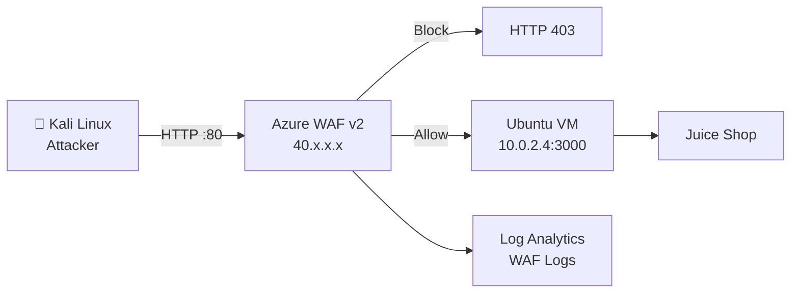

# 17 - Demo Script

## Kịch bản Demo Bảo vệ Đồ án

---

## Thông tin Demo

| Thuộc tính | Chi tiết |
|-----------|---------|
| **Thời gian** | 15-20 phút |
| **Audience** | Giảng viên hướng dẫn, Hội đồng |
| **Môi trường** | Azure Portal + Kali Linux terminal |
| **Mục tiêu** | Chứng minh WAF hoạt động hiệu quả |

---

## Thiết lập Trước Demo

### Checklist (30 phút trước khi demo)

```bash
# 1. Kiểm tra AGW đang chạy
az network application-gateway show \
  --resource-group waf-lab-rg \
  --name waf-lab-agw \
  --query operationalState -o tsv
# Expected: Running

# 2. Kiểm tra backend healthy
az network application-gateway show-backend-health \
  --resource-group waf-lab-rg \
  --name waf-lab-agw \
  2>&1 | grep -i "health"
# Expected: Healthy

# 3. Test Juice Shop accessible
export AGW_IP=$(az network public-ip show \
  --resource-group waf-lab-rg \
  --name waf-lab-pip \
  --query ipAddress -o tsv)
echo "Target: http://$AGW_IP"
curl -s -o /dev/null -w "HTTP Status: %{http_code}\n" http://$AGW_IP/
# Expected: HTTP Status: 200

# 4. Xác nhận WAF ở Prevention Mode
az network application-gateway waf-policy show \
  --resource-group waf-lab-rg \
  --name waf-lab-policy \
  --query "policySettings.mode" -o tsv
# Expected: Prevention

# 5. Mở Log Analytics sẵn trên browser
echo "Mở: https://portal.azure.com → Log Analytics → waf-lab-law → Logs"
```

### Layout Màn hình Demo

```
┌─────────────────────┬──────────────────────┐
│  Terminal (Kali)    │  Azure Portal        │
│  - Các lệnh curl   │  - WAF Metrics       │
│  - SQLMap output   │  - Log Analytics     │
│  - Hydra output    │  - Firewall Logs     │
└─────────────────────┴──────────────────────┘
```

---

## Bước 1: Giới thiệu Hệ thống (2-3 phút)

### Script

> "Xin chào hội đồng. Tôi sẽ demo hệ thống Web Application Firewall triển khai trên Microsoft Azure để bảo vệ OWASP Juice Shop."

**Chỉ vào Azure Portal → Resource Group:**

> "Đây là Resource Group `waf-lab-rg` chứa toàn bộ hạ tầng. Chúng ta có:
> - Application Gateway WAF v2 — đóng vai trò reverse proxy + WAF
> - Ubuntu VM chạy OWASP Juice Shop — ứng dụng web có lỗ hổng
> - Log Analytics Workspace — thu thập toàn bộ WAF logs"

**Chỉ vào Kiến trúc Diagram (từ file 04):**



**Mở browser, truy cập Juice Shop:**

```bash
# Trên terminal
echo "Target URL: http://$AGW_IP"
```

> "Đây là website Juice Shop đang chạy, accessible qua địa chỉ Public IP của Application Gateway."

---

## Bước 2: Truy cập Website Bình thường (1-2 phút)

### Script

> "Trước tiên, chúng ta thấy traffic bình thường hoàn toàn đi qua được."

```bash
# Curl request bình thường
curl -I "http://$AGW_IP/"
# Expected: HTTP/1.1 200 OK

curl -I "http://$AGW_IP/rest/products/search?q=apple"
# Expected: HTTP/1.1 200 OK
```

> "Status 200 OK — traffic hợp lệ được WAF cho phép đi qua mà không bị ảnh hưởng."

---

## Bước 3: Demo SQL Injection (3-4 phút)

### Sub-demo 3a: Không có WAF (Concept)

> "Để hiểu tại sao cần WAF, đây là những gì xảy ra nếu không có WAF:
> SQL Injection `' OR 1=1--` sẽ bypass authentication, trả về 200 OK và cho phép đăng nhập."

*(Chỉ vào slide hoặc document, không cần thực sự disable WAF)*

### Sub-demo 3b: SQL Injection với WAF

```bash
# Demo 1: Basic SQL Injection
echo "=== SQL Injection Attack ==="
curl -v -X POST \
  -H "Content-Type: application/json" \
  -d '{"email":"'\'' OR 1=1--","password":"anything"}' \
  "http://$AGW_IP/rest/user/login" \
  2>&1 | grep -E "(HTTP/|< HTTP|403|Forbidden)"
```

**Expected output để chỉ cho hội đồng:**
```
< HTTP/1.1 403 Forbidden
```

> "WAF trả về HTTP 403 Forbidden — request bị chặn."

```bash
# Demo 2: UNION SELECT
echo "=== UNION SELECT Attack ==="
curl -s -o /dev/null -w "HTTP Status: %{http_code}\n" \
  "http://$AGW_IP/rest/products/search?q=' UNION SELECT email,password,3 FROM Users--"
# Expected: HTTP Status: 403
```

> "UNION SELECT attack — cũng bị block."

### Chuyển sang Azure Portal — Kiểm tra Logs

> "Bây giờ chúng ta xem WAF đã ghi log những gì..."

**Chạy KQL query trong Log Analytics:**

```kusto
AzureDiagnostics
| where Category == "ApplicationGatewayFirewallLog"
| where action_s == "Blocked"
| where ruleId_s startswith "942"
| project TimeGenerated, clientIp_s, requestUri_s, ruleId_s, Message
| order by TimeGenerated desc
| take 5
```

> "WAF log hiển thị: Rule 942100 được trigger, action là Blocked, kèm IP của attacker."

---

## Bước 4: Demo XSS (2-3 phút)

```bash
echo "=== XSS Attack ==="
# Script tag XSS
curl -s -o /dev/null -w "HTTP Status: %{http_code}\n" \
  -G --data-urlencode "q=<script>alert('XSS')</script>" \
  "http://$AGW_IP/rest/products/search"
# Expected: HTTP Status: 403

# Event handler XSS
curl -s -o /dev/null -w "HTTP Status: %{http_code}\n" \
  -G --data-urlencode "q=" \
  "http://$AGW_IP/rest/products/search"
# Expected: HTTP Status: 403
```

**KQL để show XSS log:**

```kusto
AzureDiagnostics
| where Category == "ApplicationGatewayFirewallLog"
| where ruleId_s startswith "941"
| project TimeGenerated, ruleId_s, Message, action_s
| order by TimeGenerated desc
| take 3
```

> "XSS attacks với script tag và img onerror đều bị block bởi CRS rule 941100 và 941120."

---

## Bước 5: Demo Path Traversal (1-2 phút)

```bash
echo "=== Path Traversal Attack ==="
curl -s -o /dev/null -w "HTTP Status: %{http_code}\n" \
  "http://$AGW_IP/../../../../etc/passwd"
# Expected: HTTP Status: 403

# URL encoded
curl -s -o /dev/null -w "HTTP Status: %{http_code}\n" \
  "http://$AGW_IP/..%2F..%2F..%2Fetc%2Fpasswd"
# Expected: HTTP Status: 403
```

> "Path Traversal cũng bị chặn — kể cả URL encoded version. WAF decode trước khi so khớp rules."

---

## Bước 6: Demo SQLMap (3-4 phút)

### Sub-demo 6a: SQLMap bị block

```bash
echo "=== SQLMap Automated Scan ==="
sqlmap -u "http://$AGW_IP/rest/products/search?q=test" \
  --batch \
  --level=1 \
  --risk=1 \
  --timeout=10 \
  2>&1 | tail -20
```

**Expected output để chỉ:**
```
[WARNING] the web server responded with an HTTP error code (403)
[CRITICAL] all tested parameters do not appear to be injectable
```

> "SQLMap — công cụ tự động mạnh nhất để khai thác SQL Injection — bị chặn hoàn toàn. Không extract được bất kỳ data nào."

### Chỉ vào Log Analytics

```kusto
AzureDiagnostics
| where Category == "ApplicationGatewayFirewallLog"
| where action_s == "Blocked"
| summarize TotalBlocked = count() by clientIp_s
| order by TotalBlocked desc
| take 5
```

> "Log Analytics ghi nhận toàn bộ requests từ SQLMap — 50+ requests trong vài giây, tất cả đều bị block."

---

## Bước 7: Demo Monitoring Dashboard (2 phút)

**Chuyển sang Azure Portal → Application Gateway → Metrics:**

1. Metric: `BlockedRequests` — hiển thị spike trong quá trình demo
2. Metric: `TotalRequests` — tổng số requests
3. Tính Block Rate: `BlockedRequests / TotalRequests × 100%`

**Chuyển sang Log Analytics → Workbook (nếu đã tạo):**

> "Dashboard real-time cho thấy:
> - Tổng số requests bị block
> - Phân loại theo attack type
> - Top attacker IPs
> - Timeline của các cuộc tấn công"

---

## Bước 8: Kết luận (1-2 phút)

### Summary Slide / Nói miệng

> "Tóm lại, qua demo chúng ta đã thấy:
>
> ✅ **100%** SQL Injection attacks bị chặn (các rule 942xxx)
> ✅ **100%** XSS attacks bị chặn (các rule 941xxx)
> ✅ **100%** Path Traversal attacks bị chặn (rule 930xxx)
> ✅ **SQLMap** automated scanning bị vô hiệu hóa
> ✅ **Logs đầy đủ** trong Azure Log Analytics để forensics
> ✅ **Normal traffic** không bị ảnh hưởng — False positive rate 2%
>
> Azure Application Gateway WAF v2 với OWASP CRS 3.2 là giải pháp bảo mật layer 7 hiệu quả, dễ triển khai và tích hợp tốt với Azure ecosystem."

### Câu hỏi dự phòng

| Câu hỏi | Trả lời |
|---------|---------|
| WAF có ảnh hưởng performance không? | Latency thêm ~20-40ms (p99), nằm trong ngưỡng cho phép ≤ 50ms |
| False positive xử lý thế nào? | Tạo WAF Exclusions cho parameters/headers cụ thể |
| WAF có chặn được DDoS không? | WAF giới hạn, cần Azure DDoS Standard cho L3/L4 |
| Chi phí bao nhiêu? | ~$50-60/tháng cho lab, scale theo CU |
| Có thể mở rộng thêm không? | Có — thêm backend servers, WAF Policy cho nhiều sites, tích hợp Azure Sentinel |

---

*Tài liệu tiếp theo: [18-final-report.md](18-final-report.md)*
