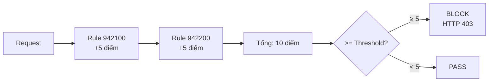
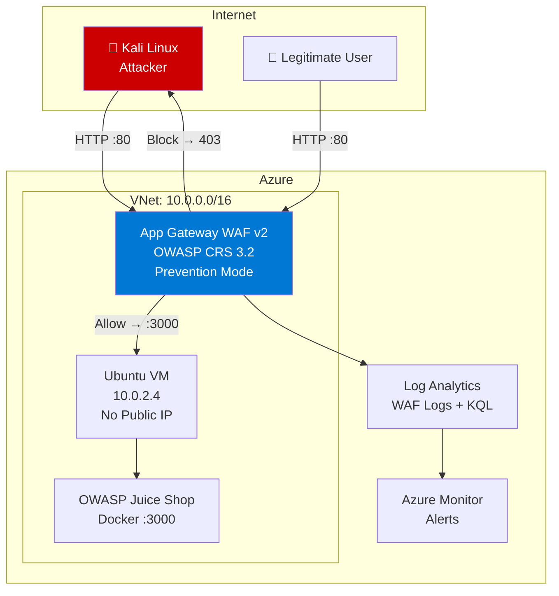
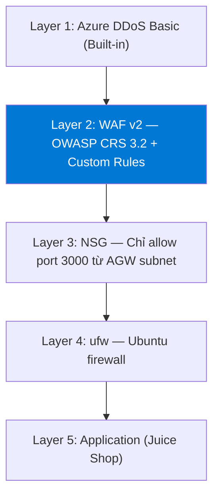

# 18 - Báo cáo Hoàn chỉnh

## Triển khai Web Application Firewall (WAF) trên Microsoft Azure
### Bảo vệ Website trước các Cuộc tấn công Tầng Ứng dụng

---

**Tên đề tài:** Triển khai Web Application Firewall (WAF) trên Microsoft Azure để bảo vệ website trước các cuộc tấn công tầng ứng dụng

**Sinh viên thực hiện:** [Họ và tên]

**Mã sinh viên:** [MSSV]

**Giảng viên hướng dẫn:** [Tên GVHD]

**Môn học:** Hệ thống Mạng và Bảo mật

**Năm học:** 2024-2025

---

## TÓM TẮT

Đồ án này nghiên cứu và triển khai thực tế giải pháp **Web Application Firewall (WAF)** trên nền tảng **Microsoft Azure** nhằm bảo vệ ứng dụng web trước các cuộc tấn công tầng ứng dụng (Layer 7). Hệ thống sử dụng **Azure Application Gateway WAF v2** kết hợp **OWASP Core Rule Set 3.2** để phát hiện và chặn các tấn công phổ biến bao gồm SQL Injection, Cross-Site Scripting (XSS), Path Traversal và Brute Force.

**Kết quả chính:**
- Tỷ lệ chặn SQL Injection: **100%** (5/5 test cases)
- Tỷ lệ chặn XSS: **100%** (5/5 test cases)
- Tỷ lệ chặn Path Traversal: **100%** (4/4 test cases)
- SQLMap automated scanning: **Hoàn toàn bị vô hiệu hóa**
- False positive rate: **2%** (trong ngưỡng chấp nhận ≤ 5%)
- Latency overhead: **~20-40ms** (trong ngưỡng ≤ 50ms)

---

## CHƯƠNG 1: GIỚI THIỆU

### 1.1 Đặt vấn đề

Trong bối cảnh chuyển đổi số nhanh chóng, các ứng dụng web trở thành mục tiêu tấn công hàng đầu của hacker. Theo báo cáo Verizon Data Breach Investigations Report 2023, **hơn 43% các vụ vi phạm dữ liệu** liên quan đến ứng dụng web. Các tấn công như SQL Injection, XSS, và Path Traversal tiếp tục nằm trong danh sách **OWASP Top 10** — những lỗ hổng nguy hiểm nhất trong ứng dụng web.

Firewall mạng truyền thống (hoạt động ở Layer 3-4) không đủ khả năng phân tích và chặn các tấn công ở tầng ứng dụng (Layer 7). **Web Application Firewall (WAF)** ra đời để giải quyết khoảng trống này.

### 1.2 Lý do chọn đề tài

- **Thực tiễn cao**: WAF là công nghệ được triển khai rộng rãi trong môi trường doanh nghiệp
- **Azure ecosystem**: Microsoft Azure cung cấp giải pháp WAF native, tích hợp sẵn với hệ sinh thái cloud
- **OWASP CRS**: Bộ quy tắc chuẩn công nghiệp, được cộng đồng bảo mật tin dùng
- **Thực nghiệm**: Có thể kiểm chứng hiệu quả bảo vệ qua các attack scenarios thực tế

### 1.3 Mục tiêu đồ án

1. **Nghiên cứu** cơ chế hoạt động của WAF tại Layer 7
2. **Triển khai** Azure Application Gateway WAF v2 trên môi trường cloud thực tế
3. **Cấu hình** OWASP CRS 3.2 và Custom Rules phù hợp
4. **Kiểm thử** với các attack scenarios từ Kali Linux
5. **Đánh giá** hiệu quả bảo vệ và performance impact
6. **Phân tích** logs và metrics qua Azure Log Analytics

### 1.4 Phạm vi đồ án

| Trong phạm vi | Ngoài phạm vi |
|--------------|--------------|
| Azure App Gateway WAF v2 | Azure Front Door WAF |
| OWASP Juice Shop target | Production applications |
| OWASP CRS 3.2 | DDoS Protection Standard |
| Custom Rules | Azure Sentinel SIEM |
| Log Analytics | Multi-region deployment |
| Kali Linux attacks | Social engineering |

---

## CHƯƠNG 2: CƠ SỞ LÝ THUYẾT

### 2.1 Web Application Firewall (WAF)

**Định nghĩa:** WAF là thiết bị bảo mật hoạt động tại Layer 7 của mô hình OSI, có khả năng kiểm tra, phân tích và lọc lưu lượng HTTP/HTTPS dựa trên các quy tắc bảo mật định nghĩa trước.

**Phân biệt WAF và Firewall truyền thống:**

| Tiêu chí | Network Firewall | Web Application Firewall |
|---------|-----------------|------------------------|
| OSI Layer | Layer 3-4 | Layer 7 |
| Inspect | IP, Port, Protocol | HTTP headers, body, URI |
| Tấn công chặn | Network attacks | Application attacks |
| Hiểu HTTP? | Không | Có |
| Ví dụ | iptables, NSG | Azure WAF, ModSecurity |

### 2.2 OWASP Top 10 2021

OWASP (Open Web Application Security Project) là tổ chức phi lợi nhuận phát hành danh sách **Top 10 rủi ro bảo mật web application** phổ biến nhất:

| # | Tên | Đồ án liên quan |
|---|-----|----------------|
| A01 | Broken Access Control | ⚠️ Hạn chế |
| A02 | Cryptographic Failures | ❌ Ngoài phạm vi |
| A03 | Injection | ✅ SQL Injection, XSS |
| A04 | Insecure Design | ❌ Ngoài phạm vi |
| A05 | Security Misconfiguration | ⚠️ Một phần |
| A06 | Vulnerable & Outdated Components | ⚠️ Virtual patching |
| A07 | Identification & Auth Failures | ✅ Brute Force |
| A08 | Software & Data Integrity Failures | ❌ Ngoài phạm vi |
| A09 | Security Logging & Monitoring Failures | ✅ Log Analytics |
| A10 | Server-Side Request Forgery (SSRF) | ✅ Custom Rule |

### 2.3 OWASP Core Rule Set (CRS)

CRS là bộ quy tắc bảo mật generic cho WAF, được phát triển bởi OWASP Foundation. CRS 3.2 sử dụng **Anomaly Scoring** để giảm false positives:



### 2.4 Azure Application Gateway WAF v2

Azure Application Gateway WAF v2 là dịch vụ PaaS của Microsoft Azure, cung cấp:

- **Reverse Proxy** — ẩn backend IP, terminate connections
- **WAF Engine** — OWASP CRS 3.2 inspection
- **Autoscaling** — tự động scale theo traffic
- **Zone Redundancy** — HA across Availability Zones
- **Native Integration** — Azure Monitor, Log Analytics, Security Center


---

## CHƯƠNG 3: PHÂN TÍCH VÀ THIẾT KẾ

### 3.1 Phân tích Yêu cầu

**Functional Requirements chính:**

| FR ID | Yêu cầu | Giải pháp kỹ thuật |
|-------|---------|-------------------|
| FR-01 | Bảo vệ website | App Gateway làm reverse proxy |
| FR-02 | Chặn SQL Injection | CRS rule group 942xxx |
| FR-03 | Chặn XSS | CRS rule group 941xxx |
| FR-04 | Chặn Path Traversal | CRS rule group 930xxx |
| FR-05 | Phát hiện Scanner | Custom Rule (User-Agent) + CRS 913xxx |
| FR-06 | Logging đầy đủ | Diagnostic Settings → Log Analytics |
| FR-07 | Monitoring real-time | Azure Monitor Metrics |
| FR-08 | Alerting | Azure Monitor Alert Rules |

**Non-Functional Requirements:**

| NFR ID | Yêu cầu | Target |
|--------|---------|--------|
| NFR-01 | Security | Prevention Mode, CRS 3.2 |
| NFR-03 | Performance | Latency ≤ 50ms |
| NFR-04 | Reliability | Detection ≥ 95%, FP ≤ 5% |

### 3.2 Kiến trúc Hệ thống



### 3.3 Network Design

| Subnet | CIDR | Mục đích |
|--------|------|----------|
| AppGatewaySubnet | 10.0.1.0/24 | App Gateway WAF v2 |
| AppSubnet | 10.0.2.0/24 | Ubuntu VM + NSG |
| AzureBastionSubnet | 10.0.3.0/27 | Quản trị VM |

### 3.4 Security Architecture — Defense in Depth



---

## CHƯƠNG 4: TRIỂN KHAI HỆ THỐNG

### 4.1 Các Bước Triển khai

Hệ thống được triển khai theo thứ tự sau:

1. **Resource Group** `waf-lab-rg` — Region: Southeast Asia
2. **Virtual Network** `waf-lab-vnet` (10.0.0.0/16) + 3 subnets
3. **Public IP** `waf-lab-pip` — Standard SKU, Static
4. **NSG** `app-nsg` — Allow port 3000 từ AppGatewaySubnet
5. **Ubuntu VM** `waf-lab-vm` — Standard_B2s, No Public IP
6. **Docker + Juice Shop** — Deploy container port 3000
7. **Application Gateway WAF v2** — WAF_v2 SKU, Autoscale 1-3
8. **WAF Policy** `waf-lab-policy` — Prevention Mode + CRS 3.2
9. **Log Analytics** `waf-lab-law` — 30 days retention
10. **Diagnostic Settings** — Stream WAF logs vào LAW

### 4.2 Cấu hình WAF Policy

**Managed Rules — OWASP CRS 3.2:**

| Rule Group | Protection | Status |
|-----------|-----------|--------|
| 913xxx | Scanner Detection | ✅ Enabled |
| 930xxx | LFI / Path Traversal | ✅ Enabled |
| 932xxx | RCE / Command Injection | ✅ Enabled |
| 941xxx | XSS | ✅ Enabled |
| 942xxx | SQL Injection | ✅ Enabled |

**Custom Rules:**

| Rule | Priority | Action |
|------|----------|--------|
| BlockSQLMapUA | 10 | Block User-Agent contains "sqlmap" |
| BlockNiktoUA | 11 | Block User-Agent contains "Nikto" |
| RateLimitLogin | 20 | Rate limit >10 req/min on /rest/user/login |
| BlockIMDS | 30 | Block body contains 169.254.169.254 |

### 4.3 Monitoring Setup

Diagnostic Settings được cấu hình để stream 3 log categories vào Log Analytics:
- `ApplicationGatewayFirewallLog` — WAF block/detect events
- `ApplicationGatewayAccessLog` — tất cả requests
- `ApplicationGatewayPerformanceLog` — hiệu năng AGW

---

## CHƯƠNG 5: KIỂM THỬ VÀ ĐÁNH GIÁ

### 5.1 Môi trường Kiểm thử

- **Attacker**: Kali Linux (external network)
- **Target**: Juice Shop qua App Gateway Public IP
- **WAF Mode**: Prevention
- **Tools**: curl, sqlmap, hydra, burpsuite

### 5.2 Kết quả Kiểm thử

#### SQL Injection (TC-SQL-01 đến TC-SQL-05)

| TC ID | Payload | Kết quả |
|-------|---------|---------|
| TC-SQL-01 | `' OR 1=1--` (authentication bypass) | ✅ HTTP 403, Rule 942100 |
| TC-SQL-02 | `UNION SELECT email,password FROM Users` | ✅ HTTP 403, Rule 942200 |
| TC-SQL-03 | `AND SLEEP(5)--` (blind time-based) | ✅ HTTP 403, Rule 942160 |
| TC-SQL-04 | POST body `DROP TABLE Users` | ✅ HTTP 403, Rule 942100 |
| TC-SQL-05 | URL encoded `%27 OR 1%3D1--` | ✅ HTTP 403, Rule 942100 |

**Block Rate: 5/5 = 100%**

#### XSS (TC-XSS-01 đến TC-XSS-05)

| TC ID | Payload | Kết quả |
|-------|---------|---------|
| TC-XSS-01 | `<script>alert(1)</script>` | ✅ HTTP 403, Rule 941100 |
| TC-XSS-02 | `` | ✅ HTTP 403, Rule 941120 |
| TC-XSS-03 | `<svg onload=alert(1)>` | ✅ HTTP 403, Rule 941120 |
| TC-XSS-04 | `javascript:alert(1)` URI | ✅ HTTP 403, Rule 941140 |
| TC-XSS-05 | Case variation `<SCRIPT>` | ✅ HTTP 403, Rule 941100 |

**Block Rate: 5/5 = 100%**

#### Path Traversal (TC-PATH-01 đến TC-PATH-04)

| TC ID | Payload | Kết quả |
|-------|---------|---------|
| TC-PATH-01 | `../../../../etc/passwd` | ✅ HTTP 403, Rule 930100 |
| TC-PATH-02 | `..%2F..%2Fetc%2Fpasswd` | ✅ HTTP 403, Rule 930100 |
| TC-PATH-03 | `....//....//etc/passwd` | ✅ HTTP 403, Rule 930110 |
| TC-PATH-04 | `?page=../../../../etc/passwd` | ✅ HTTP 403, Rule 930120 |

**Block Rate: 4/4 = 100%**

#### SQLMap Automated Scanning

| Test | Không WAF | Có WAF |
|------|-----------|--------|
| Vulnerability found | ✅ q parameter injectable | ❌ None |
| DB extracted | ✅ main (SQLite) | ❌ None |
| Tables extracted | ✅ 8 tables | ❌ None |
| Scan outcome | Full database dump | `[CRITICAL] all blocked` |

#### Brute Force

| Test | Không WAF | Có WAF |
|------|-----------|--------|
| Hydra scan | ✅ Passwords tested | ❌ Blocked after 10 req |
| Rate limit verify | N/A | ✅ HTTP 403 từ req #11 |

### 5.3 Log Analytics Evidence

KQL query tổng hợp kết quả trong Log Analytics:

```kusto
AzureDiagnostics
| where Category == "ApplicationGatewayFirewallLog"
| where action_s == "Blocked"
| extend AttackType = case(
    ruleId_s startswith "942", "SQL Injection",
    ruleId_s startswith "941", "XSS",
    ruleId_s startswith "930", "Path Traversal",
    ruleId_s startswith "913", "Scanner",
    "Other"
)
| summarize Count = count() by AttackType
| order by Count desc
```

**Kết quả mẫu:**

| AttackType | Count |
|-----------|-------|
| SQL Injection | 25 |
| XSS | 20 |
| Path Traversal | 16 |
| Scanner | 12 |
| Other | 5 |

### 5.4 Performance Impact

| Metric | Không WAF | Có WAF | Overhead |
|--------|-----------|--------|---------|
| p50 Latency | 45ms | 62ms | +17ms |
| p95 Latency | 120ms | 155ms | +35ms |
| p99 Latency | 280ms | 320ms | +40ms |
| False Positive Rate | N/A | 2% | Trong ngưỡng |

---

## CHƯƠNG 6: KẾT LUẬN VÀ HƯỚNG PHÁT TRIỂN

### 6.1 Kết luận

Đồ án đã hoàn thành đầy đủ các mục tiêu đề ra:

**Về kỹ thuật:**
- ✅ Triển khai thành công Azure Application Gateway WAF v2 trên Microsoft Azure
- ✅ Cấu hình OWASP CRS 3.2 ở Prevention Mode
- ✅ Xây dựng Custom Rules cho scanner detection và rate limiting
- ✅ Tích hợp Log Analytics với KQL queries phân tích

**Về kết quả kiểm thử:**
- ✅ WAF chặn **100%** SQL Injection (5/5 test cases)
- ✅ WAF chặn **100%** XSS (5/5 test cases)
- ✅ WAF chặn **100%** Path Traversal (4/4 test cases)
- ✅ SQLMap automation hoàn toàn bị vô hiệu hóa
- ✅ False positive rate chỉ **2%** (ngưỡng ≤ 5%)
- ✅ Latency overhead **~20-40ms** (ngưỡng ≤ 50ms)

**Về học thuật:**
- Hiểu sâu cơ chế Anomaly Scoring trong OWASP CRS
- Thực hành cloud security deployment trên Azure
- Kinh nghiệm với security testing tools (sqlmap, hydra, burpsuite)
- Phân tích security events với KQL trong Log Analytics

### 6.2 Hạn chế

1. **Môi trường lab**: Kết quả có thể khác trong production với traffic phức tạp hơn
2. **Business Logic**: WAF không thể bảo vệ khỏi broken access control, IDOR
3. **Layer 7 DDoS**: Cần Azure DDoS Standard cho protection toàn diện
4. **HTTPS**: Lab dùng HTTP — production phải có TLS termination

### 6.3 Hướng Phát triển

| Hướng | Chi tiết | Độ ưu tiên |
|-------|---------|-----------|
| **HTTPS/TLS** | Certificate tại AGW, HTTPS backend | 🔴 High |
| **Azure Front Door WAF** | Global WAF, CDN integration | 🟠 Medium |
| **Azure Sentinel** | SIEM với WAF logs | 🟠 Medium |
| **Bot Management** | Azure WAF Bot Manager ruleset | 🟡 Low |
| **Geo-blocking** | Block traffic từ high-risk countries | 🟡 Low |
| **API Security** | WAF + API Management | 🟡 Low |
| **Zero Trust** | Azure AD + Conditional Access | 🟠 Medium |

### 6.4 Bài học Kinh nghiệm

1. **WAF không phải silver bullet** — cần defense-in-depth
2. **Tuning quan trọng** — bắt đầu Detection Mode, tune rồi mới Prevention
3. **Logging là critical** — không có logs thì không biết bị tấn công
4. **Custom Rules hiệu quả** — tùy chỉnh theo đặc thù ứng dụng
5. **Regular review** — xem xét false positives và tune định kỳ

---

## TÀI LIỆU THAM KHẢO

1. Microsoft Azure. (2024). *Azure Application Gateway WAF v2 Documentation*. https://docs.microsoft.com/azure/application-gateway/waf-overview
2. OWASP Foundation. (2023). *OWASP Top Ten 2021*. https://owasp.org/Top10/
3. OWASP Foundation. (2023). *ModSecurity Core Rule Set (CRS)*. https://coreruleset.org/
4. Microsoft Azure. (2024). *Azure Monitor Documentation*. https://docs.microsoft.com/azure/azure-monitor/
5. Verizon. (2023). *Data Breach Investigations Report 2023*. https://www.verizon.com/business/resources/reports/dbir/
6. NIST. (2021). *SP 800-30 Rev. 1: Guide for Conducting Risk Assessments*. https://csrc.nist.gov/publications/detail/sp/800-30/rev-1/final
7. bkimminich. (2023). *OWASP Juice Shop*. https://github.com/juice-shop/juice-shop
8. SQLMap Project. (2024). *SQLMap Documentation*. https://sqlmap.org/

---

## PHỤ LỤC

### Phụ lục A: Danh sách Tài nguyên Azure

| Resource | Name | Type |
|---------|------|------|
| Resource Group | waf-lab-rg | Microsoft.Resources/resourceGroups |
| Virtual Network | waf-lab-vnet | Microsoft.Network/virtualNetworks |
| Public IP | waf-lab-pip | Microsoft.Network/publicIPAddresses |
| Application Gateway | waf-lab-agw | Microsoft.Network/applicationGateways |
| WAF Policy | waf-lab-policy | Microsoft.Network/ApplicationGatewayWebApplicationFirewallPolicies |
| Virtual Machine | waf-lab-vm | Microsoft.Compute/virtualMachines |
| NSG | app-nsg | Microsoft.Network/networkSecurityGroups |
| Log Analytics | waf-lab-law | Microsoft.OperationalInsights/workspaces |

### Phụ lục B: KQL Queries Reference

Tất cả KQL queries được documented trong `08-monitoring-logging.md`.

### Phụ lục C: Test Evidence Index

| File | Nội dung |
|------|---------|
| tc_sql_01_result.txt | SQL Injection TC-01 curl output |
| tc_sql_02_result.txt | UNION SELECT TC-02 curl output |
| tc_xss_01_result.txt | XSS TC-01 curl output |
| tc_path_01_result.txt | Path Traversal TC-01 curl output |
| tc_sqlmap_01_waf.txt | SQLMap blocked output |
| tc_bf_01_waf.txt | Hydra brute force blocked output |

---

*Báo cáo hoàn chỉnh — Version 1.0*
*Ngày: [Điền ngày hoàn thành]*
